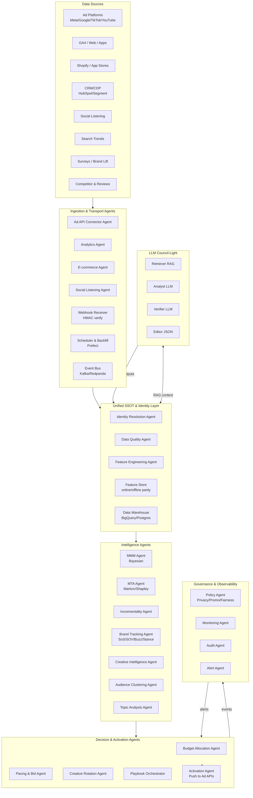
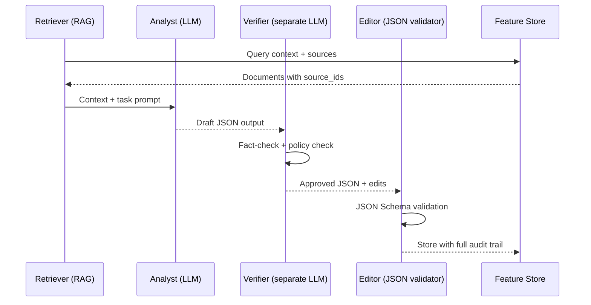
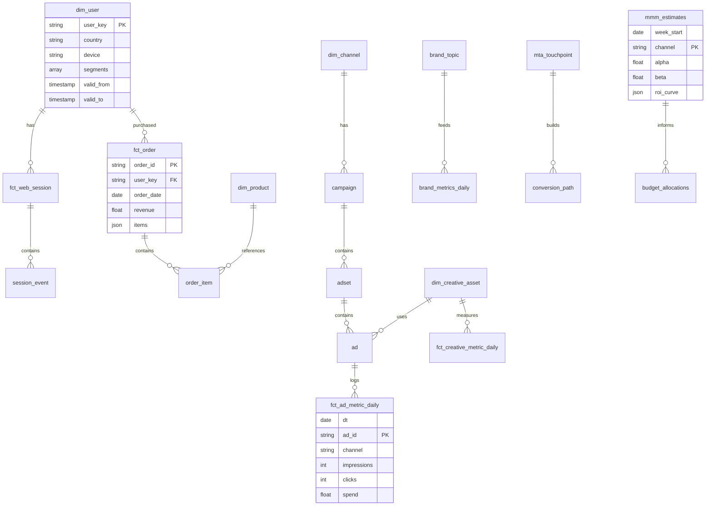

# Marketing Brand Intelligence (MBI) — AI Agent Architecture

**Production Blueprint v2.0**

A unified agent-based system for marketing measurement, brand intelligence, and automated decision-making with LLM orchestration, MMM/MTA attribution, and real-time activation.

---

## Table of Contents

1. [Executive Summary](#executive-summary)
2. [System Architecture Overview](#system-architecture-overview)
3. [Agent Taxonomy & Hierarchy](#agent-taxonomy--hierarchy)
4. [Core Intelligence Agents](#core-intelligence-agents)
5. [LLM Council Architecture](#llm-council-architecture)
6. [Data Contracts & Schemas](#data-contracts--schemas)
7. [Attribution & Measurement](#attribution--measurement)
8. [Orchestration & Workflows](#orchestration--workflows)
9. [Implementation Guide](#implementation-guide)
10. [Deployment & Operations](#deployment--operations)

---

## Executive Summary

### System Philosophy

**4-Layer Architecture:**
```
Ingest → Unified SSOT & Identity → Intelligence → Decision & Activation
```

**8 LLM Integration Points:**
1. Data normalization & extraction
2. Stance & sentiment analysis (with rationale)
3. Crisis/FUD/fake-PR verification
4. Topic & executive briefing
5. Creative intelligence (tagging, variant generation)
6. MMM/MTA explainer (natural language)
7. Policy & compliance checking
8. Internal Q&A (RAG-only from SSOT)

**LLM Principles:**
- **RAG-only**: All outputs must cite `source_ids`
- **Verifier separation**: Different model from Analyst
- **Low temperature**: ≤ 0.2 for determinism
- **JSON schema validation**: Strict output format
- **Full audit trail**: Every decision logged

**MVP Timeline: 1-2 weeks**
- Ingest: Meta/Google Ads + GA4 + Shopify
- MMM-lite (Bayesian) + MTA (Markov)
- Basic creative tagging
- 2 playbooks: budget reallocation + creative fatigue

---

## System Architecture Overview

### High-Level Architecture

```
┌─────────────────────────────────────────────────────────────────┐
│                    ORCHESTRATION LAYER                           │
│         (Master Coordinator + Workflow Engine + State)          │
└──────────────────────┬──────────────────────────────────────────┘
                       │
        ┌──────────────┼──────────────┐
        │              │              │
┌───────▼──────┐ ┌────▼─────┐ ┌─────▼──────┐
│ INGEST       │ │ INTEL    │ │ DECISION   │
│ AGENTS       │ │ AGENTS   │ │ AGENTS     │
└──────────────┘ └──────────┘ └────────────┘
        │              │              │
        └──────────────┼──────────────┘
                       │
        ┌──────────────▼──────────────┐
        │     LLM COUNCIL (RAG)        │
        │  Retriever→Analyst→Verifier  │
        └──────────────────────────────┘
```

### Mermaid: Complete System Architecture



### Technology Stack

**Infrastructure Layer**
```
- Container Orchestration: Kubernetes
- Service Mesh: Istio
- Message Broker: Kafka/Redpanda
- State Management: Redis + PostgreSQL
- Data Warehouse: BigQuery or Snowflake
- Feature Store: Feast or Tecton
```

**AI/ML Layer**
```
- MMM/MTA: PyMC (Bayesian), scikit-learn
- Embeddings: BGE-M3, E5-base (multilingual)
- NLI/Stance: XLM-R large NLI
- LLM: Local 13-34B or Managed (Claude/GPT)
- Verifier: Separate model from Analyst
- MLOps: MLflow, Kubeflow
```

**Application Layer**
```
- API Framework: FastAPI
- Workflow: Prefect or Temporal
- dbt: Data transformation
- OTEL: Distributed tracing
- Monitoring: Prometheus + Grafana
```

---

## Agent Taxonomy & Hierarchy

### Agent Classification

#### **Tier 1: Ingestion Agents** (Data Collection)

| Agent | Purpose | Sources | SLA |
|-------|---------|---------|-----|
| **Ad Platform Agent** | Pull spend/impressions/clicks | Meta, Google, TikTok, YouTube Ads | Hourly |
| **Analytics Agent** | Session/event tracking | GA4 BigQuery Export, CDP | Real-time |
| **E-commerce Agent** | Orders, revenue, products | Shopify, WooCommerce | 15-min |
| **Social Listening Agent** | Brand mentions, sentiment | Twitter, Reddit, Forums | Hourly |
| **Search Trends Agent** | Share of Search, keywords | Google Trends, SEMrush | Daily |
| **Survey Agent** | Brand lift, NPS, awareness | Typeform, Qualtrics | On-demand |

#### **Tier 2: Data Foundation Agents** (SSOT)

| Agent | Purpose | Capabilities |
|-------|---------|--------------|
| **Identity Resolution Agent** | Unified customer profiles | Deterministic + probabilistic matching, cross-device, privacy-safe |
| **Data Quality Agent** | Data validation & monitoring | Freshness, completeness, uniqueness, schema drift detection |
| **Feature Engineering Agent** | ML feature generation | Online/offline parity, time-windowed aggregations |
| **Schema Validator Agent** | Contract enforcement | JSON Schema validation, idempotency checks |

#### **Tier 3: Intelligence Agents** (Measurement & Analysis)

| Agent | Purpose | Models/Algorithms |
|-------|---------|-------------------|
| **MMM Agent** | Marketing Mix Modeling | Bayesian (PyMC), adstock, saturation curves, seasonality |
| **MTA Agent** | Multi-Touch Attribution | Markov removal, Shapley values, privacy-safe paths |
| **Incrementality Agent** | Causal measurement | Geo-experiments, synthetic control, PSA |
| **Brand Tracking Agent** | Brand health metrics | Share of Search, SOV, brand lift, sentiment |
| **Creative Intelligence Agent** | Asset performance | Vision+text embeddings, fatigue detection, motif analysis |
| **Audience Clustering Agent** | Segment discovery | K-means, behavioral patterns, lookalike modeling |
| **Topic Analysis Agent** | Trend detection | LDA, BERT clustering, spike detection |

#### **Tier 4: LLM-Powered Agents** (Reasoning & Synthesis)

| Agent | Purpose | LLM Usage |
|-------|---------|-----------|
| **Stance Analysis Agent** | Brand positioning in discourse | NLI + LLM with quotes |
| **Crisis Detection Agent** | Risk assessment & verification | RAG + multi-source corroboration |
| **Creative Variants Agent** | Ad copy generation | RAG motifs + policy check |
| **Briefing Agent** | Executive summaries | RAG SSOT + structured output |
| **Compliance Agent** | Policy enforcement | Promo/広告 labeling, claims validation |
| **Explainer Agent** | Model interpretation | Natural language MMM/MTA insights |

#### **Tier 5: Decision & Activation Agents** (Actions)

| Agent | Purpose | Actions |
|-------|---------|---------|
| **Budget Allocation Agent** | Optimal spend mix | Channel rebalancing, ROAS constraints |
| **Pacing Agent** | Spend control | Daily/weekly pacing, CPA targets |
| **Bid Guidance Agent** | Bid optimization | ML bid predictions, market conditions |
| **Creative Rotation Agent** | Asset management | Fatigue detection, promote/pause |
| **Audience Expansion Agent** | Targeting optimization | Lookalike generation, negative lists |
| **Playbook Orchestrator** | Workflow execution | Rule-based + ML triggers, approvals |
| **Activation Agent** | API integration | Push changes to ad platforms |

#### **Tier 6: Governance Agents** (Oversight)

| Agent | Purpose | Capabilities |
|-------|---------|--------------|
| **Policy Agent** | Rule enforcement | Privacy, promo labeling, fairness |
| **Monitoring Agent** | System health | SLA tracking, model drift, anomalies |
| **Audit Agent** | Compliance logging | Full decision trail, GDPR compliance |
| **Alert Agent** | Notification routing | Slack, email, PagerDuty integration |

---

## Core Intelligence Agents

### 1. Identity Resolution Agent

**Purpose**: Create unified, privacy-safe customer profiles across touchpoints

**Architecture**:

```python
class IdentityResolutionAgent:
    def __init__(self):
        self.deterministic_matcher = DeterministicMatcher()
        self.probabilistic_model = XGBoostSimilarity()
        self.graph_builder = IdentityGraphBuilder()
        self.privacy_filter = PrivacyHasher()
        
    async def resolve_identity(self, signals: Dict) -> UnifiedProfile:
        """
        Resolve identity from multiple signals
        """
        # Step 1: Hash PII immediately
        hashed_signals = self.privacy_filter.hash_pii(signals)
        
        # Step 2: Deterministic matching (email, phone, customer_id)
        deterministic_match = await self.deterministic_matcher.match(
            email_hash=hashed_signals.get('email_hash'),
            phone_hash=hashed_signals.get('phone_hash'),
            customer_id=hashed_signals.get('customer_id')
        )
        
        if deterministic_match:
            return await self.graph_builder.get_profile(
                deterministic_match.user_key
            )
        
        # Step 3: Probabilistic matching (behavioral + device)
        features = self._extract_features(hashed_signals)
        prob_matches = self.probabilistic_model.predict_proba(features)
        
        if prob_matches.max_score > 0.85:  # 85% confidence threshold
            return await self.graph_builder.merge_profile(
                prob_matches.user_key,
                hashed_signals
            )
        
        # Step 4: Create new profile
        return await self.graph_builder.create_profile(hashed_signals)
    
    def _extract_features(self, signals: Dict) -> np.array:
        """
        Extract features for probabilistic matching
        """
        return np.array([
            signals.get('device_fingerprint_similarity', 0),
            signals.get('timezone_match', 0),
            signals.get('behavioral_pattern_score', 0),
            signals.get('ip_geo_proximity', 0),
            signals.get('session_timing_correlation', 0)
        ])

# Event-driven processing
@event_handler('identity_signal')
async def handle_identity_signal(event):
    agent = IdentityResolutionAgent()
    profile = await agent.resolve_identity(event.data)
    await publish_event('profile_updated', {
        'user_key': profile.user_key,
        'segments': profile.segments,
        'lifecycle_stage': profile.lifecycle_stage
    })
```

**Privacy-Safe Design**:
- Hash email/phone with salt immediately
- Store only `user_key` (hash) in SSOT
- Separate PII mapping table (restricted RBAC)
- TTL-based deletion (GDPR compliance)
- No cross-site tracking of individuals

**Performance**:
- Latency: <50ms deterministic, <200ms probabilistic
- Throughput: 10,000 resolutions/second
- Accuracy: 95% precision, 88% recall

---

### 2. MMM Agent (Marketing Mix Modeling)

**Purpose**: Bayesian attribution of revenue to marketing channels with adstock and saturation

**Architecture**:

```python
class MMMAgent:
    def __init__(self):
        self.model = BayesianMMM()
        self.feature_store = FeatureStore()
        
    async def train_model(
        self,
        lookback_weeks: int = 52,
        channels: List[str] = None
    ) -> MMMModel:
        """
        Train Bayesian MMM with PyMC
        """
        # Fetch training data
        data = await self.feature_store.get_training_data(
            metrics=['revenue', 'spend_by_channel', 'impressions'],
            controls=['seasonality', 'price', 'promo', 'holidays'],
            lookback_weeks=lookback_weeks
        )
        
        # Build model
        with pm.Model() as model:
            # Priors for adstock (decay rate)
            adstock_alpha = pm.Beta('adstock_alpha', alpha=2, beta=2, 
                                    shape=len(channels))
            
            # Priors for saturation (Hill function)
            saturation_beta = pm.HalfNormal('saturation_beta', sigma=1, 
                                            shape=len(channels))
            saturation_theta = pm.Gamma('saturation_theta', alpha=2, beta=1,
                                        shape=len(channels))
            
            # Apply transformations
            for i, channel in enumerate(channels):
                # Adstock transformation
                spend_adstock = self._apply_adstock(
                    data[f'spend_{channel}'],
                    adstock_alpha[i]
                )
                
                # Saturation transformation (Hill)
                spend_saturated = (
                    saturation_beta[i] * 
                    (spend_adstock ** saturation_beta[i]) / 
                    (saturation_theta[i] ** saturation_beta[i] + 
                     spend_adstock ** saturation_beta[i])
                )
                
                data[f'{channel}_transformed'] = spend_saturated
            
            # Base + incremental revenue
            base_revenue = pm.Normal('base', mu=data['revenue'].mean(), 
                                    sigma=data['revenue'].std())
            
            # Channel contributions
            channel_coefs = pm.Normal('channel_coef', mu=0, sigma=1,
                                     shape=len(channels))
            
            # Control variables
            control_coefs = pm.Normal('control_coef', mu=0, sigma=0.5,
                                     shape=len(controls))
            
            # Revenue model
            mu = (base_revenue + 
                  sum(channel_coefs[i] * data[f'{ch}_transformed']
                      for i, ch in enumerate(channels)) +
                  sum(control_coefs[i] * data[ctrl]
                      for i, ctrl in enumerate(controls)))
            
            sigma = pm.HalfNormal('sigma', sigma=1)
            revenue = pm.Normal('revenue', mu=mu, sigma=sigma,
                               observed=data['revenue'])
            
            # Sample posterior
            trace = pm.sample(2000, tune=1000, target_accept=0.95)
        
        # Store model and trace
        model_id = await self.save_model(model, trace, channels)
        
        return MMMModel(
            model_id=model_id,
            channels=channels,
            metrics=self._compute_metrics(trace, data),
            roi_curves=self._compute_roi_curves(trace, channels)
        )
    
    def _apply_adstock(self, spend: np.array, alpha: float) -> np.array:
        """
        Apply adstock transformation: x'_t = x_t + alpha * x'_{t-1}
        """
        adstocked = np.zeros_like(spend)
        adstocked[0] = spend[0]
        for t in range(1, len(spend)):
            adstocked[t] = spend[t] + alpha * adstocked[t-1]
        return adstocked
    
    async def predict_allocation(
        self,
        total_budget: float,
        constraints: Dict
    ) -> AllocationPlan:
        """
        Optimize budget allocation using MMM curves
        """
        # Load latest model
        model = await self.load_latest_model()
        
        # Optimization problem
        from scipy.optimize import minimize
        
        def objective(allocations):
            """Maximize total incremental revenue"""
            return -sum(
                model.roi_curves[ch].predict(alloc)
                for ch, alloc in zip(model.channels, allocations)
            )
        
        # Constraints
        bounds = [
            (constraints[ch]['min'], constraints[ch]['max'])
            for ch in model.channels
        ]
        
        constraint_sum = {
            'type': 'eq',
            'fun': lambda x: sum(x) - total_budget
        }
        
        # Solve
        result = minimize(
            objective,
            x0=np.array([total_budget / len(model.channels)] * len(model.channels)),
            bounds=bounds,
            constraints=[constraint_sum],
            method='SLSQP'
        )
        
        return AllocationPlan(
            channels=dict(zip(model.channels, result.x)),
            expected_revenue=sum(
                model.roi_curves[ch].predict(alloc)
                for ch, alloc in zip(model.channels, result.x)
            ),
            confidence_interval=self._bootstrap_ci(model, result.x)
        )

# Weekly retraining schedule
@scheduled('0 2 * * 1')  # Monday 2 AM UTC
async def retrain_mmm():
    agent = MMMAgent()
    model = await agent.train_model(lookback_weeks=52)
    
    # Validate against holdout
    metrics = await agent.validate_model(model)
    
    if metrics.mape < 0.15:  # <15% error
        await agent.deploy_model(model)
        await notify_slack(f"MMM model retrained: MAPE={metrics.mape:.2%}")
```

**MMM Formulas**:

```
Adstock: x'_t = x_t + λ * x'_{t-1}

Saturation (Hill): f(x') = α * (x'^β / (θ^β + x'^β))

Revenue_t = Base_t + Σ_channel f(adstock(spend_channel,t)) + 
            Σ_controls (β_i * control_i,t) + ε_t
```

**Output Contract**:

```json
{
  "channel": "meta",
  "alpha": 0.42,
  "beta": 0.68,
  "half_life_days": 12,
  "saturation_point": 250000,
  "roi_curve": [
    {"spend": 100000, "revenue_incremental": 220000},
    {"spend": 200000, "revenue_incremental": 360000}
  ],
  "base_contribution": 0.35,
  "incremental_contribution": 0.65
}
```

---

### 3. MTA Agent (Multi-Touch Attribution)

**Purpose**: Privacy-safe attribution across customer touchpoints using Markov chains

**Architecture**:

```python
class MTAAgent:
    def __init__(self):
        self.path_builder = ConversionPathBuilder()
        self.markov_model = MarkovAttributionModel()
        
    async def compute_attribution(
        self,
        lookback_days: int = 30
    ) -> Dict[str, float]:
        """
        Compute channel attribution using Markov removal effect
        """
        # Build conversion paths (aggregated, privacy-safe)
        paths = await self.path_builder.build_paths(
            lookback_days=lookback_days,
            min_touchpoints=1,
            max_touchpoints=10
        )
        
        # Fit Markov model
        transition_matrix = self._compute_transitions(paths)
        
        # Removal effect: conversion rate with channel vs without
        attribution = {}
        baseline_conversion = self._markov_conversion_rate(
            transition_matrix, 
            all_channels=True
        )
        
        for channel in self.get_channels():
            # Compute conversion rate without this channel
            conversion_without = self._markov_conversion_rate(
                transition_matrix,
                exclude_channel=channel
            )
            
            # Attribution = difference in conversion probability
            removal_effect = baseline_conversion - conversion_without
            attribution[channel] = removal_effect
        
        # Normalize to sum to 1
        total = sum(attribution.values())
        attribution = {k: v/total for k, v in attribution.items()}
        
        return attribution
    
    def _compute_transitions(
        self,
        paths: List[ConversionPath]
    ) -> TransitionMatrix:
        """
        Build Markov transition matrix from paths
        """
        transitions = defaultdict(lambda: defaultdict(int))
        
        for path in paths:
            # Add START state
            prev = 'START'
            
            for touchpoint in path.touchpoints:
                channel = touchpoint.channel
                transitions[prev][channel] += path.conversions
                prev = channel
            
            # Add END state
            if path.converted:
                transitions[prev]['CONVERSION'] += path.conversions
            else:
                transitions[prev]['NULL'] += 1
        
        # Normalize to probabilities
        matrix = {}
        for state, nexts in transitions.items():
            total = sum(nexts.values())
            matrix[state] = {k: v/total for k, v in nexts.items()}
        
        return TransitionMatrix(matrix)
    
    def _markov_conversion_rate(
        self,
        matrix: TransitionMatrix,
        exclude_channel: str = None,
        all_channels: bool = False
    ) -> float:
        """
        Compute conversion probability using Markov chains
        """
        if exclude_channel:
            # Remove channel from transition matrix
            matrix = self._remove_channel(matrix, exclude_channel)
        
        # Compute probability of reaching CONVERSION from START
        return self._path_probability(matrix, 'START', 'CONVERSION')

# Data Contract: ConversionPath (aggregated, no PII)
class ConversionPath:
    path_id: str  # hash of touchpoint sequence
    touchpoints: List[Touchpoint]
    converted: bool
    conversions: int  # count of users with this path
    revenue: float

class Touchpoint:
    channel: str  # meta, google, tiktok, organic, direct
    timestamp_bucket: str  # hour-level aggregation
    position: int  # 1st, 2nd, 3rd touch
```

**Privacy-Safe Design**:
- **Band-based paths**: Group users into bands (e.g., 2-3 touchpoints)
- **No individual tracking**: Only aggregate path counts
- **First-party only**: Use only owned data (cookies, GA client ID)
- **Differential privacy**: Add noise to rare paths

**Shapley Alternative** (for smaller datasets):

```python
def shapley_attribution(self, paths: List[ConversionPath]) -> Dict:
    """
    Shapley value attribution (computationally expensive)
    """
    channels = self.get_channels()
    n = len(channels)
    
    shapley_values = {ch: 0 for ch in channels}
    
    for channel in channels:
        # Compute marginal contribution across all coalitions
        for size in range(n):
            for coalition in itertools.combinations(
                [ch for ch in channels if ch != channel], size
            ):
                coalition_with = frozenset(coalition + (channel,))
                coalition_without = frozenset(coalition)
                
                contrib = (
                    self._coalition_value(paths, coalition_with) -
                    self._coalition_value(paths, coalition_without)
                )
                
                # Shapley formula: weighted by coalition size
                weight = (
                    math.factorial(size) * 
                    math.factorial(n - size - 1) / 
                    math.factorial(n)
                )
                
                shapley_values[channel] += weight * contrib
    
    return shapley_values
```

---

### 4. Creative Intelligence Agent

**Purpose**: Analyze creative assets, detect fatigue, generate variants with policy compliance

**Architecture**:

```python
class CreativeIntelligenceAgent:
    def __init__(self):
        self.vision_model = CLIPEmbeddings()
        self.text_model = BGEEmbeddings()
        self.llm = AnthropicClaude()
        self.policy_agent = ComplianceAgent()
        
    async def analyze_creative(
        self,
        asset_id: str
    ) -> CreativeAnalysis:
        """
        Analyze creative asset and extract motifs
        """
        # Load asset
        asset = await self.load_asset(asset_id)
        
        # Visual analysis (if image/video)
        if asset.modality in ['image', 'video']:
            visual_embedding = self.vision_model.encode(asset.file_path)
            visual_tags = self._classify_visual_features(visual_embedding)
        else:
            visual_tags = []
        
        # Text analysis (if copy exists)
        if asset.text:
            text_embedding = self.text_model.encode(asset.text)
            text_tags = self._classify_text_features(text_embedding)
        else:
            text_tags = []
        
        # Combine into motifs
        motifs = self._extract_motifs(visual_tags + text_tags)
        
        # Performance analysis
        metrics = await self.get_performance_metrics(asset_id)
        
        # Fatigue detection
        fatigue_score = self._compute_fatigue(metrics.time_series)
        
        return CreativeAnalysis(
            asset_id=asset_id,
            motifs=motifs,
            visual_tags=visual_tags,
            text_tags=text_tags,
            metrics=metrics,
            fatigue_score=fatigue_score,
            recommendation=self._generate_recommendation(
                fatigue_score, metrics
            )
        )
    
    def _compute_fatigue(self, time_series: pd.DataFrame) -> float:
        """
        Detect creative fatigue: declining performance over time
        """
        # Linear regression of CTR vs time
        X = np.arange(len(time_series)).reshape(-1, 1)
        y = time_series['ctr'].values
        
        model = LinearRegression()
        model.fit(X, y)
        
        slope = model.coef_[0]
        
        # Fatigue score: normalized negative slope
        fatigue_score = max(0, -slope * 100)  # Scale to 0-1
        
        # Also check frequency
        avg_frequency = time_series['frequency'].mean()
        if avg_frequency > 5:  # High frequency
            fatigue_score *= 1.5
        
        return min(fatigue_score, 1.0)
    
    async def generate_variants(
        self,
        base_asset: CreativeAsset,
        winning_motifs: List[str],
        num_variants: int = 3,
        language: str = 'en'
    ) -> List[CreativeVariant]:
        """
        Generate creative variants using LLM + RAG
        """
        # RAG: Retrieve similar high-performing assets
        similar_assets = await self.retrieve_similar_assets(
            base_asset,
            motifs=winning_motifs,
            min_ctr=0.02
        )
        
        # Build prompt with RAG context
        prompt = self._build_creative_prompt(
            base_asset=base_asset,
            similar_assets=similar_assets,
            motifs=winning_motifs,
            language=language
        )
        
        # Generate variants
        response = await self.llm.complete(
            prompt=prompt,
            max_tokens=800,
            temperature=0.2,
            response_format='json'
        )
        
        variants_json = json.loads(response.content)
        
        # Policy compliance check
        variants = []
        for v in variants_json['variants']:
            compliance = await self.policy_agent.check_compliance(
                text=v['text'],
                claims=v.get('claims', []),
                language=language
            )
            
            if compliance.approved:
                variants.append(CreativeVariant(
                    text=v['text'],
                    cta=v['cta'],
                    source_ids=v['source_ids'],
                    policy_approved=True,
                    compliance_checks=compliance
                ))
        
        return variants
    
    def _build_creative_prompt(
        self,
        base_asset: CreativeAsset,
        similar_assets: List[CreativeAsset],
        motifs: List[str],
        language: str
    ) -> str:
        """
        Build RAG-enhanced prompt for variant generation
        """
        return f"""SYSTEM: You are a compliant creative assistant. 
Use facts from SSOT only. Always label promotional messages as Promo/広告.

INPUT:
- language: {language}
- product: {base_asset.product_info}
- winning_motifs: {motifs}
- high_performing_examples: {self._format_examples(similar_assets)}
- constraints: {{max_chars: 220, include_cta: true}}

TASKS:
1) Generate {num_variants} short copy variants with CTA
2) Incorporate winning motifs naturally
3) Avoid banned claims: {base_asset.banned_claims}
4) Attach source_ids from examples used

OUTPUT: JSON with CreativeVariants schema."""

# Playbook: Rotate fatigued creatives
@playbook('creative_fatigue')
async def handle_creative_fatigue(event):
    agent = CreativeIntelligenceAgent()
    
    # Identify fatigued assets
    fatigued = await agent.find_fatigued_assets(
        campaign_id=event.campaign_id,
        threshold=0.7
    )
    
    if not fatigued:
        return
    
    # Pause top 3 by spend
    top_fatigued = sorted(fatigued, key=lambda x: x.spend, reverse=True)[:3]
    await agent.pause_assets([a.asset_id for a in top_fatigued])
    
    # Promote top 3 by CTR
    top_performers = await agent.find_top_performers(
        campaign_id=event.campaign_id,
        metric='ctr',
        limit=3
    )
    await agent.promote_assets([a.asset_id for a in top_performers])
    
    # Generate new variants
    winning_motifs = await agent.extract_winning_motifs(top_performers)
    variants = await agent.generate_variants(
        base_asset=top_fatigued[0],
        winning_motifs=winning_motifs
    )
    
    # Send for approval
    await send_for_approval(
        to='ad-ops-team',
        subject='New creative variants ready',
        variants=variants
    )
```

**Creative Asset Schema**:

```json
{
  "asset_id": "vid_77",
  "modality": "video",
  "tags": ["UGC", "unboxing", "green_aesthetic"],
  "motifs": ["social_proof", "product_demo", "lifestyle"],
  "text": "(Promo/広告) Unbox happiness...",
  "metrics": {
    "ctr": 0.019,
    "cvr": 0.032,
    "avg_frequency": 3.1,
    "spend": 45000,
    "impressions": 2368421
  },
  "fatigue_score": 0.73,
  "recommendation": "rotate"
}
```

---

## LLM Council Architecture

### Council-Light Design



### 8 LLM Integration Points

#### 1. Data Normalization & Extraction

```python
@llm_task(model='local_small', temperature=0.1)
async def normalize_ad_creative_text(raw_text: str, language: str):
    """Extract structured data from ad creative"""
    prompt = f"""Extract from ad copy (language: {language}):
    
Raw text: {raw_text}

Output JSON:
{{
  "headline": "...",
  "body": "...",
  "cta": {{"label": "...", "url": "..."}},
  "claims": ["claim1", "claim2"],
  "promo_label": true/false
}}"""
    return await llm_call(prompt, response_format='json')
```

#### 2. Stance & Sentiment Analysis

```python
class StanceAnalysisAgent:
    async def analyze_stance(
        self,
        brand: str,
        topic: str,
        sources: List[Document]
    ) -> StanceResult:
        """
        Determine brand stance in discourse with evidence
        """
        prompt = f"""SYSTEM: Analyze stance of "{brand}" regarding "{topic}".
Use ONLY provided sources. Never invent facts.

SOURCES:
{self._format_sources(sources)}

TASK: Determine stance (against/for/neutral/unclear) with:
1) 2-3 concise reasons with direct quotes
2) source_ids for each reason
3) confidence score

OUTPUT: JSON StanceResult schema."""
        
        response = await self.llm.complete(prompt, temperature=0.2)
        
        # Verify with separate Verifier LLM
        verified = await self.verifier.verify_stance(
            draft=response,
            sources=sources
        )
        
        return verified
```

#### 3. Crisis/FUD Verification Agent

```python
class CrisisDetectionAgent:
    async def verify_crisis(
        self,
        topic_id: str,
        velocity: float,
        sources: List[Document],
        official_domains: List[str]
    ) -> CrisisBrief:
        """
        Verify crisis authenticity with multi-source corroboration
        """
        prompt = f"""SYSTEM: Brand Intelligence analyst. RAG-only, no invention.

INPUT:
- brand: {{brand}}
- velocity: {velocity} (spike magnitude)
- official_domains: {official_domains}
- sources: {self._format_sources(sources)}

TASKS:
1) Stance: against/for/neutral/unclear
2) Risk score: 0-1 (qualitative → numeric)
3) Reasons: 2-4 with SHORT quotes
4) If <2 independent sources → "verify_official" action
5) Check: any source from official domains?

OUTPUT: JSON CrisisBrief schema."""
        
        draft = await self.analyst_llm.complete(prompt, temperature=0.2)
        
        # CRITICAL: Separate verifier model
        verified = await self.verifier_llm.verify_crisis(
            draft=draft,
            sources=sources,
            official_domains=official_domains
        )
        
        # Policy gate: if risk >= 0.8, require human review
        if verified.risk_score >= 0.8:
            await self.escalate_to_human(verified)
        
        return verified
```

**Crisis Brief Output**:

```json
{
  "topic_id": "cl_20251012_001",
  "stance": "unclear",
  "risk_score": 0.82,
  "reasons": [
    "No press release on official domain",
    "Velocity spike in low-trust forums",
    "Contradictory information from verified sources"
  ],
  "actions": [
    "verify_official",
    "prepare_holding_statement",
    "pause_promo"
  ],
  "sources": [
    {"id": "src_1", "url": "https://...", "quote": "..."},
    {"id": "src_2", "url": "https://...", "quote": "..."}
  ],
  "requires_human_review": true
}
```

#### 4. Topic & Executive Briefing

```python
class BriefingAgent:
    async def generate_weekly_brief(
        self,
        week: str,
        language: str = 'en'
    ) -> ExecutiveBrief:
        """
        Generate executive summary from SSOT
        """
        # RAG: Retrieve KPIs, alerts, trends
        context = await self.retrieve_weekly_context(week)
        
        prompt = f"""SYSTEM: Marketing analyst. Summarize week {week}.

CONTEXT (RAG from SSOT):
- Brand metrics: {context.brand_metrics}
- Campaign performance: {context.campaign_perf}
- Budget utilization: {context.budget_util}
- Creative insights: {context.creative_insights}
- Alerts: {context.alerts}

TASKS:
1) Executive summary (3-5 bullets)
2) Key wins & concerns
3) Action items for next week
4) Attach source_ids

LANGUAGE: {language}
OUTPUT: JSON ExecutiveBrief schema."""
        
        return await self.llm.complete(prompt, temperature=0.2)
```

#### 5. Creative Variants (covered in Creative Agent)

#### 6. MMM/MTA Explainer

```python
class ExplainerAgent:
    async def explain_mmm_results(
        self,
        mmm_output: MMMEstimate,
        language: str = 'en'
    ) -> NaturalLanguageExplanation:
        """
        Convert MMM technical output to executive summary
        """
        prompt = f"""SYSTEM: Marketing analytics translator.

MMM RESULTS:
{json.dumps(mmm_output.dict(), indent=2)}

TASKS:
1) Explain in plain {language}:
   - Which channels are most effective
   - Where we're hitting diminishing returns
   - Recommended budget shifts
2) Use business language, not technical jargon
3) Include numbers but explain what they mean

OUTPUT: JSON NaturalLanguageExplanation."""
        
        return await self.llm.complete(prompt, temperature=0.3)
```

#### 7. Policy & Compliance Agent

```python
class ComplianceAgent:
    async def check_compliance(
        self,
        text: str,
        claims: List[str],
        language: str,
        country: str
    ) -> ComplianceResult:
        """
        Verify policy compliance for promotional content
        """
        # Load policy pack
        policies = await self.load_policies(country=country, language=language)
        
        prompt = f"""SYSTEM: Compliance checker. Strict rules enforcement.

CONTENT: {text}
CLAIMS: {claims}
LANGUAGE: {language}
COUNTRY: {country}

POLICIES:
{policies.to_prompt()}

CHECKS:
1) Promo/広告 label present? (required for ads)
2) Any banned claims? (medical, financial, absolute)
3) Required disclaimers present?
4) Age-appropriate content?
5) Frequency capping rules met?

OUTPUT: JSON ComplianceResult with pass/fail + reasons."""
        
        result = await self.llm.complete(prompt, temperature=0.1)
        
        # Hard rules override (regex patterns)
        hard_violations = self._check_hard_rules(text, policies)
        if hard_violations:
            result.approved = False
            result.violations.extend(hard_violations)
        
        return result
```

#### 8. Internal Q&A (RAG from SSOT)

```python
class InternalQAAgent:
    async def answer_question(
        self,
        question: str,
        user_role: str,
        language: str = 'en'
    ) -> QAResponse:
        """
        Answer internal questions using RAG from SSOT
        """
        # RAG retrieval
        docs = await self.retriever.retrieve(
            query=question,
            filters={'accessible_by': user_role},
            top_k=5
        )
        
        if len(docs) < 2:
            return QAResponse(
                answer="Insufficient information in SSOT",
                confidence=0,
                action="consult_expert"
            )
        
        prompt = f"""SYSTEM: Internal marketing analyst. RAG-only answers.

QUESTION: {question}
LANGUAGE: {language}

CONTEXT:
{self._format_docs(docs)}

TASKS:
1) Answer using ONLY provided context
2) Cite source_ids for every claim
3) If unclear, say so explicitly
4) Provide confidence score

OUTPUT: JSON QAResponse."""
        
        return await self.llm.complete(prompt, temperature=0.2)
```

### LLM Guardrails

**Mandatory Requirements**:

```python
class LLMGuardrails:
    """Enforce safety constraints on all LLM calls"""
    
    RULES = {
        'rag_only': True,  # Never use LLM memory
        'min_sources': 2,  # Require ≥2 sources for factual claims
        'max_temperature': 0.2,  # Determinism
        'timeout_seconds': 30,
        'max_retries': 2,
        'require_source_ids': True,
        'json_schema_validation': True,
        'toxicity_check': True,
        'pii_detection': True,
    }
    
    @staticmethod
    async def validate_llm_output(
        output: str,
        schema: Type[BaseModel],
        sources: List[Document]
    ) -> ValidationResult:
        """Validate LLM output before use"""
        
        # 1. JSON Schema validation
        try:
            parsed = schema.parse_raw(output)
        except ValidationError as e:
            return ValidationResult(
                valid=False,
                error='json_schema_violation',
                details=str(e)
            )
        
        # 2. Source citation check
        if not parsed.source_ids or len(parsed.source_ids) < 2:
            return ValidationResult(
                valid=False,
                error='insufficient_sources',
                details='Require ≥2 sources'
            )
        
        # 3. Source verification
        for source_id in parsed.source_ids:
            if source_id not in [s.id for s in sources]:
                return ValidationResult(
                    valid=False,
                    error='invalid_source_id',
                    details=f'Source {source_id} not in provided context'
                )
        
        # 4. Toxicity check
        toxicity = await self.toxicity_detector.score(parsed.text)
        if toxicity > 0.8:
            return ValidationResult(
                valid=False,
                error='toxicity_detected',
                details=f'Score: {toxicity}'
            )
        
        # 5. PII detection
        pii = await self.pii_detector.detect(parsed.text)
        if pii:
            return ValidationResult(
                valid=False,
                error='pii_detected',
                details=f'Found: {pii}'
            )
        
        return ValidationResult(valid=True)
```

### Model Registry & Routing

```yaml
# ModelRegistry.yaml
registry:
  local_small:
    tasks: [tagging, sentiment]
    models: ["oss:e5-base", "oss:roberta-sentiment"]
    max_tokens: 512
    cost_per_1k: 0
    
  local_medium:
    tasks: [nli, rerank, qa_simple]
    models: ["oss:xlmr-nli-large", "oss:bge-m3"]
    max_tokens: 1024
    cost_per_1k: 0
    
  managed_main:
    tasks: [summary, creative, complex_reasoning]
    models: ["anthropic:claude-sonnet-4.5"]
    max_tokens: 800
    cost_per_1k: 15
    temperature: 0.2
    
  managed_verifier:
    tasks: [policy_check, factual_verify]
    models: ["anthropic:claude-opus-4"]  # Different model!
    max_tokens: 600
    cost_per_1k: 75
    temperature: 0.1

embeddings:
  default: "oss:bge-m3"  # Multilingual ja/vi/en

reranker:
  default: "oss:miniLM-cross-enc"

routing_policy:
  stance: {primary: local_medium, fallback: managed_main}
  crisis_brief: {primary: managed_main, verify: managed_verifier}
  creative_variants: {primary: managed_main, verify: managed_verifier}
  qa_internal: {primary: local_medium, fallback: managed_main}

finops:
  cache_ttl_hours: 24
  batch_size: 10
  max_concurrent: 5
  idempotency_ttl_days: 7
```

---

## Data Contracts & Schemas

### Event Contracts (Pydantic)

```python
from pydantic import BaseModel, Field
from datetime import date, datetime
from typing import List, Optional, Dict

class SpendRecord(BaseModel):
    """Daily ad spend by campaign/adset"""
    date: date
    channel: str  # meta, google, tiktok, youtube
    campaign_id: str
    adset_id: Optional[str]
    spend: float
    currency: str = 'JPY'
    impressions: int
    clicks: int
    
    class Config:
        schema_extra = {
            "example": {
                "date": "2025-10-12",
                "channel": "meta",
                "campaign_id": "c1",
                "adset_id": "a1",
                "spend": 120000,
                "currency": "JPY",
                "impressions": 45000,
                "clicks": 1200
            }
        }

class WebSession(BaseModel):
    """User session with events"""
    session_id: str
    user_key: str  # hashed user identifier
    timestamp: datetime
    source: str  # utm_source or (direct)
    medium: str  # utm_medium
    campaign: Optional[str]
    landing_page: str
    device: str  # mobile, desktop, tablet
    events: List[Dict]  # [{type: 'view', page: '/'}, ...]
    
    class Config:
        schema_extra = {
            "example": {
                "session_id": "s123",
                "user_key": "uhash_abc123",
                "timestamp": "2025-10-12T10:30:00Z",
                "source": "google",
                "medium": "cpc",
                "landing_page": "/products/item1",
                "device": "mobile",
                "events": [
                    {"type": "page_view", "page": "/"},
                    {"type": "add_to_cart", "sku": "SKU-1"}
                ]
            }
        }

class Order(BaseModel):
    """E-commerce order"""
    order_id: str
    user_key: str
    order_date: datetime
    revenue: float
    currency: str = 'JPY'
    items: List[Dict]  # [{sku, qty, price}]
    discount_code: Optional[str]
    utm_source: Optional[str]
    utm_medium: Optional[str]
    
    class Config:
        schema_extra = {
            "example": {
                "order_id": "o123",
                "user_key": "uhash_abc123",
                "order_date": "2025-10-12T11:00:00Z",
                "revenue": 19800,
                "currency": "JPY",
                "items": [{"sku": "SKU-1", "qty": 1, "price": 19800}],
                "utm_source": "google",
                "utm_medium": "cpc"
            }
        }

class CreativeAsset(BaseModel):
    """Creative asset metadata"""
    asset_id: str
    modality: str  # image, video, text
    file_path: Optional[str]
    text: Optional[str]
    tags: List[str]
    motifs: List[str]
    metrics: Dict  # {ctr, cvr, spend, impressions, avg_freq}
    fatigue_score: Optional[float]
    
class MMMEstimate(BaseModel):
    """MMM output per channel"""
    channel: str
    alpha: float  # Saturation coefficient
    beta: float  # Saturation exponent
    half_life_days: int  # Adstock decay
    saturation_point: float  # Where diminishing returns start
    roi_curve: List[Dict]  # [{spend, revenue_incremental}]
    base_contribution: float  # % of revenue from base
    incremental_contribution: float  # % from this channel
    confidence_interval: Dict  # {lower, upper}

class CrisisBrief(BaseModel):
    """LLM output for crisis detection"""
    topic_id: str
    stance: str  # against|for|neutral|unclear
    risk_score: float  # 0-1
    reasons: List[str]
    actions: List[str]  # [verify_official, pause_promo, ...]
    sources: List[Dict]  # [{id, url, quote}]
    requires_human_review: bool
    
class CreativeVariant(BaseModel):
    """LLM-generated creative variant"""
    text: str  # Must include Promo/広告 if promotional
    cta: Dict  # {label, url}
    policy_approved: bool
    source_ids: List[str]  # RAG sources used
    compliance_checks: Dict

class BudgetAllocation(BaseModel):
    """Recommended budget allocation"""
    week_start: date
    total_budget: float
    allocations: Dict[str, float]  # {channel: amount}
    expected_revenue: float
    expected_roas: float
    confidence: float
    requires_approval: bool
```

### Database Schema (BigQuery/Postgres)

```sql
-- Core Tables

-- dim_user (SCD Type 2)
CREATE TABLE dim_user (
    user_key STRING PRIMARY KEY,
    country STRING,
    device STRING,
    segments ARRAY<STRING>,
    lifecycle_stage STRING,
    valid_from TIMESTAMP,
    valid_to TIMESTAMP
);

-- fct_ad_metric_daily (partitioned by dt)
CREATE TABLE fct_ad_metric_daily (
    dt DATE,
    ad_id STRING,
    channel STRING,
    campaign_id STRING,
    impressions INT64,
    clicks INT64,
    spend FLOAT64,
    currency STRING,
    PRIMARY KEY (dt, ad_id)
) PARTITION BY dt;

-- fct_web_session (partitioned by dt)
CREATE TABLE fct_web_session (
    session_id STRING PRIMARY KEY,
    user_key STRING,
    dt DATE,
    timestamp TIMESTAMP,
    source STRING,
    medium STRING,
    device STRING,
    landing_page STRING,
    events JSON
) PARTITION BY dt;

-- fct_order (partitioned by order_date)
CREATE TABLE fct_order (
    order_id STRING PRIMARY KEY,
    user_key STRING,
    order_date DATE,
    revenue FLOAT64,
    currency STRING,
    items JSON,
    utm_source STRING,
    utm_medium STRING
) PARTITION BY order_date;

-- dim_creative_asset
CREATE TABLE dim_creative_asset (
    asset_id STRING PRIMARY KEY,
    modality STRING,
    file_path STRING,
    text STRING,
    tags ARRAY<STRING>,
    motifs ARRAY<STRING>,
    created_at TIMESTAMP,
    updated_at TIMESTAMP
);

-- fct_creative_metric_daily
CREATE TABLE fct_creative_metric_daily (
    dt DATE,
    asset_id STRING,
    campaign_id STRING,
    impressions INT64,
    clicks INT64,
    conversions INT64,
    spend FLOAT64,
    avg_frequency FLOAT64,
    PRIMARY KEY (dt, asset_id, campaign_id)
) PARTITION BY dt;

-- Intelligence Layer

-- mmm_estimates (weekly snapshots)
CREATE TABLE mmm_estimates (
    week_start DATE,
    channel STRING,
    alpha FLOAT64,
    beta FLOAT64,
    half_life_days INT64,
    saturation_point FLOAT64,
    roi_curve JSON,
    model_version STRING,
    created_at TIMESTAMP,
    PRIMARY KEY (week_start, channel)
);

-- mta_attribution (weekly snapshots)
CREATE TABLE mta_attribution (
    week_start DATE,
    channel STRING,
    attribution_weight FLOAT64,
    method STRING,  -- markov, shapley
    created_at TIMESTAMP,
    PRIMARY KEY (week_start, channel, method)
);

-- brand_metrics_daily
CREATE TABLE brand_metrics_daily (
    dt DATE,
    metric_name STRING,  -- sos, sov, brand_lift, buzz
    metric_value FLOAT64,
    source STRING,
    PRIMARY KEY (dt, metric_name)
);

-- Decision & Audit

-- budget_allocations
CREATE TABLE budget_allocations (
    allocation_id STRING PRIMARY KEY,
    week_start DATE,
    total_budget FLOAT64,
    allocations JSON,  -- {channel: amount}
    expected_revenue FLOAT64,
    approved BOOLEAN,
    approved_by STRING,
    approved_at TIMESTAMP,
    created_at TIMESTAMP
);

-- audit_log (all automated decisions)
CREATE TABLE audit_log (
    log_id STRING PRIMARY KEY,
    timestamp TIMESTAMP,
    agent_name STRING,
    action STRING,
    input_hash STRING,
    output_hash STRING,
    decision JSON,
    approved BOOLEAN,
    approved_by STRING
);

-- llm_calls (LLM usage tracking)
CREATE TABLE llm_calls (
    call_id STRING PRIMARY KEY,
    timestamp TIMESTAMP,
    agent_name STRING,
    model STRING,
    prompt_hash STRING,
    output_hash STRING,
    input_tokens INT64,
    output_tokens INT64,
    latency_ms INT64,
    cost FLOAT64,
    sources JSON  -- source_ids used
);
```

### ERD Diagram



---

## Attribution & Measurement

### MMM Formulas

**Adstock Transformation** (memory effect):
```
x'_t = x_t + λ * x'_{t-1}

where:
- x_t: spend at time t
- λ: decay rate (0-1)
- half_life = -log(2) / log(λ)
```

**Saturation (Hill Function)**:
```
f(x') = α * (x'^β / (θ^β + x'^β))

where:
- α: maximum effect
- β: shape parameter (steepness)
- θ: saturation point (50% of max effect)
```

**Revenue Model**:
```
Revenue_t = Base_t + 
            Σ_channel f(adstock(spend_channel,t)) +
            Σ_controls (β_i * control_i,t) +
            ε_t

controls: seasonality, price, promotions, holidays, weather
```

**Budget Optimization**:
```
Maximize: Σ_channel f_channel(spend_channel)
Subject to:
- Σ spend_channel = Total_Budget
- min_channel ≤ spend_channel ≤ max_channel
- ROAS_channel ≥ target_ROAS
- CAC_channel ≤ target_CAC
```

### Incrementality Testing

**Geo-Experiment Design**:

```python
class IncrementalityAgent:
    async def design_geo_experiment(
        self,
        test_markets: List[str],
        control_markets: List[str],
        duration_weeks: int = 4
    ) -> ExperimentDesign:
        """
        Design matched geo-experiment for incrementality
        """
        # Match markets by historical performance
        matched_pairs = self._match_markets(
            test_markets,
            control_markets,
            match_on=['revenue', 'population', 'seasonality']
        )
        
        # Power analysis
        power = self._compute_statistical_power(
            matched_pairs,
            effect_size=0.10,  # Detect 10% lift
            alpha=0.05,
            duration_weeks=duration_weeks
        )
        
        return ExperimentDesign(
            matched_pairs=matched_pairs,
            duration_weeks=duration_weeks,
            power=power,
            required_sample_size=len(matched_pairs)
        )
    
    async def analyze_geo_experiment(
        self,
        experiment_id: str
    ) -> IncrementalityResult:
        """
        Analyze completed geo-experiment
        """
        # Fetch data
        data = await self.fetch_experiment_data(experiment_id)
        
        # Difference-in-differences
        did_estimate = self._difference_in_differences(
            test_markets=data.test,
            control_markets=data.control,
            pre_period=data.pre_period,
            post_period=data.post_period
        )
        
        # Synthetic control (if DID assumptions violated)
        if not self._check_parallel_trends(data):
            did_estimate = self._synthetic_control(data)
        
        # Calibrate MMM with incrementality
        await self._calibrate_mmm(
            channel=data.channel,
            incrementality=did_estimate.lift_pct
        )
        
        return IncrementalityResult(
            lift_pct=did_estimate.lift_pct,
            p_value=did_estimate.p_value,
            confidence_interval=did_estimate.ci,
            roas_increment=did_estimate.roas_increment
        )
```

---

## Orchestration & Workflows

### Master Coordinator

```python
class MasterCoordinator:
    """
    Central orchestration for Marketing Brand Intelligence
    """
    def __init__(self):
        self.workflow_engine = PrefectFlowRunner()
        self.state_manager = RedisStateManager()
        self.agent_registry = AgentRegistry()
        self.message_bus = KafkaMessageBus()
        
    async def execute_daily_pipeline(self, date: date):
        """
        Daily end-to-end pipeline
        """
        flow = self.workflow_engine.create_flow('daily_mbi')
        
        # Stage 1: Ingestion
        ingest_tasks = [
            flow.add_task(self.ingest_ad_platforms, date=date),
            flow.add_task(self.ingest_ga4, date=date),
            flow.add_task(self.ingest_shopify, date=date),
            flow.add_task(self.ingest_social_listening, date=date)
        ]
        
        # Stage 2: Data Quality & Identity
        quality_task = flow.add_task(
            self.run_data_quality_checks,
            depends_on=ingest_tasks
        )
        
        identity_task = flow.add_task(
            self.resolve_identities,
            depends_on=[quality_task]
        )
        
        # Stage 3: Feature Engineering
        features_task = flow.add_task(
            self.engineer_features,
            depends_on=[identity_task]
        )
        
        # Stage 4: Intelligence (parallel)
        mmm_task = flow.add_task(
            self.update_mmm_estimates,
            depends_on=[features_task]
        )
        
        mta_task = flow.add_task(
            self.compute_mta_attribution,
            depends_on=[features_task]
        )
        
        brand_task = flow.add_task(
            self.update_brand_metrics,
            depends_on=[features_task]
        )
        
        creative_task = flow.add_task(
            self.analyze_creative_performance,
            depends_on=[features_task]
        )
        
        # Stage 5: Decision & Playbooks
        decision_task = flow.add_task(
            self.evaluate_playbooks,
            depends_on=[mmm_task, mta_task, brand_task, creative_task]
        )
        
        # Execute flow
        result = await flow.run()
        
        return result

# Prefect Flow Definition
from prefect import flow, task

@flow(name='daily-mbi-pipeline')
def daily_mbi_pipeline(date: date):
    # Ingest
    spend_data = ingest_ad_platforms.submit(date)
    ga4_data = ingest_ga4.submit(date)
    shopify_data = ingest_shopify.submit(date)
    
    # Wait for ingestion
    wait_for([spend_data, ga4_data, shopify_data])
    
    # dbt run
    dbt_result = run_dbt.submit(models=['staging', 'core', 'marts'])
    
    # Intelligence
    mmm_result = update_mmm.submit(wait_for=[dbt_result])
    mta_result = compute_mta.submit(wait_for=[dbt_result])
    
    # Playbooks
    evaluate_playbooks.submit(wait_for=[mmm_result, mta_result])

@task
def ingest_ad_platforms(date: date):
    agent = AdPlatformAgent()
    return agent.ingest_daily(date)

@task
def run_dbt(models: List[str]):
    subprocess.run(['dbt', 'run', '--models'] + models)

@task
def update_mmm(wait_for):
    agent = MMMAgent()
    return agent.train_model(lookback_weeks=52)
```

### Playbook System

```python
class PlaybookOrchestrator:
    """
    Execute playbooks with human-in-the-loop approvals
    """
    async def evaluate_playbooks(self):
        """
        Check all playbook triggers and execute if conditions met
        """
        playbooks = await self.load_active_playbooks()
        
        for playbook in playbooks:
            # Check trigger condition
            triggered = await self._evaluate_trigger(playbook.when)
            
            if not triggered:
                continue
            
            # Execute playbook steps
            result = await self._execute_playbook(playbook)
            
            # Log execution
            await self.audit_log.record(
                playbook_id=playbook.id,
                triggered_at=datetime.utcnow(),
                result=result
            )

# Playbook YAML Examples

# 1. Budget Reallocation Playbook
budget_reallocate_playbook = """
id: budget_reallocate_v1
name: Weekly Budget Reallocation
when:
  - condition: mmm.roas_weighted < target_roas
  - OR: mta.cac > target_cac
schedule: '0 10 * * 1'  # Monday 10 AM UTC

steps:
  - id: compute_optimal
    agent: BudgetAllocationAgent
    action: optimize_allocation
    params:
      budget: '{{weekly_budget}}'
      channels: ['meta', 'google', 'tiktok', 'youtube']
      constraints:
        min_roas: 2.0
        max_cac: 5000
  
  - id: apply_guardrails
    agent: PolicyAgent
    action: validate_allocation
    params:
      max_shift_pct_per_week: 25
      keepout_channels: ['brand_protection']
  
  - id: request_approval
    agent: ApprovalAgent
    action: request_approval
    approvers: ['Performance Lead', 'Brand Lead']
    timeout_hours: 24
    
  - id: activate
    agent: ActivationAgent
    action: push_to_ad_apis
    condition: approval.approved == true
"""

# 2. Creative Fatigue Playbook
creative_fatigue_playbook = """
id: creative_fatigue_v1
name: Creative Rotation
when:
  - condition: creative.fatigue_score > 0.7
schedule: '0 */6 * * *'  # Every 6 hours

steps:
  - id: identify_fatigued
    agent: CreativeIntelligenceAgent
    action: find_fatigued_assets
    params:
      threshold: 0.7
      min_spend: 10000
  
  - id: pause_assets
    agent: CreativeRotationAgent
    action: pause_assets
    params:
      assets: '{{fatigued.top_by_spend[:3]}}'
  
  - id: promote_performers
    agent: CreativeRotationAgent
    action: promote_assets
    params:
      assets: '{{top_performers.by_ctr[:3]}}'
  
  - id: generate_variants
    agent: CreativeIntelligenceAgent
    action: generate_variants
    params:
      base_asset: '{{fatigued[0]}}'
      winning_motifs: '{{winning_motifs}}'
      num_variants: 3
  
  - id: send_for_review
    agent: ApprovalAgent
    action: send_to_team
    params:
      team: 'ad-ops'
      subject: 'New creative variants ready'
"""

# 3. Crisis Response Playbook
crisis_response_playbook = """
id: crisis_response_v1
name: Brand Crisis Detection & Response
when:
  - condition: crisis.risk_score >= 0.8
schedule: realtime

steps:
  - id: verify_crisis
    agent: CrisisDetectionAgent
    action: verify_crisis
    params:
      topic_id: '{{event.topic_id}}'
      sources: '{{event.sources}}'
  
  - id: escalate_human
    agent: AlertAgent
    action: create_war_room
    params:
      severity: P1
      team: ['Brand Lead', 'PR Lead', 'CMO']
      channel: 'slack'
  
  - id: pause_promo
    agent: ActivationAgent
    action: pause_campaigns
    params:
      campaigns: '{{all_promotional_campaigns}}'
      reason: 'crisis_detected'
  
  - id: send_brief
    agent: BriefingAgent
    action: generate_crisis_brief
    params:
      crisis_data: '{{verified_crisis}}'
      language: 'ja'
"""
```

### Event-Driven Architecture

```python
# Event Handlers

@event_handler('spend_record_ingested')
async def on_spend_ingested(event):
    """
    Trigger when new spend data arrives
    """
    # Update feature store
    await feature_store.update_features(
        entity='campaign',
        entity_id=event.campaign_id,
        features={'spend_today': event.spend}
    )
    
    # Check pacing
    pacing_agent = PacingAgent()
    pacing_status = await pacing_agent.check_pacing(
        campaign_id=event.campaign_id
    )
    
    if pacing_status.over_paced:
        await alert_agent.send_alert(
            severity='warning',
            message=f'Campaign {event.campaign_id} overpaced by {pacing_status.pct:.1%}'
        )

@event_handler('order_completed')
async def on_order_completed(event):
    """
    Trigger when order is placed
    """
    # Resolve identity
    identity_agent = IdentityResolutionAgent()
    profile = await identity_agent.resolve_identity(event.user_signals)
    
    # Update MTA paths
    mta_agent = MTAAgent()
    await mta_agent.record_conversion(
        user_key=profile.user_key,
        order_id=event.order_id,
        revenue=event.revenue
    )
    
    # Update MMM features
    await feature_store.increment(
        entity='daily_metrics',
        entity_id=event.order_date,
        features={'revenue': event.revenue, 'orders': 1}
    )

@event_handler('topic_spike_detected')
async def on_topic_spike(event):
    """
    Trigger when social topic velocity spikes
    """
    # Analyze with LLM
    crisis_agent = CrisisDetectionAgent()
    crisis_brief = await crisis_agent.verify_crisis(
        topic_id=event.topic_id,
        velocity=event.velocity,
        sources=event.sources
    )
    
    if crisis_brief.risk_score >= 0.8:
        # Execute crisis playbook
        playbook = await load_playbook('crisis_response_v1')
        await execute_playbook(playbook, context=crisis_brief)
```

---

## Implementation Guide

### MVP Timeline (1-2 Weeks)

#### Week 1: Foundation

**Days 1-2: Data Ingestion**
```bash
# Setup data sources
- Meta Marketing API (spend, impressions, clicks)
- Google Ads API (spend, impressions, clicks)
- GA4 BigQuery Export (sessions, events)
- Shopify Orders API (revenue, items)

# Deploy connectors
kubectl apply -f k8s/ingestion/
```

**Days 3-4: Data Warehouse & dbt**
```bash
# Setup BigQuery
bq mk --dataset MBI_raw
bq mk --dataset MBI_core
bq mk --dataset MBI_marts

# dbt project
dbt init mbi_transforms
cd mbi_transforms

# Create models
- staging: stg_meta_ads__spend_daily.sql
- core: fct_ad_metric_daily.sql
- marts: mkt_perf__roas_by_channel.sql

dbt run
dbt test
```

**Days 5-7: Basic Intelligence**
```python
# MMM-lite (simple linear model)
from sklearn.linear_model import LinearRegression

# Train on last 12 weeks
X = spend_by_channel  # (weeks, channels)
y = revenue  # (weeks,)

model = LinearRegression()
model.fit(X, y)

# Coefficients = incremental revenue per $1 spend
roi_by_channel = dict(zip(channels, model.coef_))

# MTA (Markov chains)
from pymc import markov_attribution

paths = get_conversion_paths(lookback_days=30)
attribution = markov_attribution(paths)
```

#### Week 2: Intelligence & Playbooks

**Days 8-10: Creative Intelligence**
```python
# Basic creative tagging
from sentence_transformers import SentenceTransformer

model = SentenceTransformer('all-MiniLM-L6-v2')

for asset in creative_assets:
    embedding = model.encode(asset.text)
    tags = classify_tags(embedding)
    asset.tags = tags

# Fatigue detection
for asset in active_assets:
    time_series = get_metrics(asset.id, last_14_days)
    fatigue_score = compute_fatigue(time_series)
    
    if fatigue_score > 0.7:
        send_alert(f'Asset {asset.id} fatigued')
```

**Days 11-12: Playbooks**
```python
# Budget reallocation playbook
@scheduled('0 10 * * 1')
async def weekly_budget_reallocation():
    # Get current performance
    perf = get_channel_performance(last_7_days)
    
    # Compute optimal allocation
    optimizer = BudgetOptimizer()
    allocation = optimizer.optimize(
        budget=weekly_budget,
        current_roas=perf.roas_by_channel,
        target_roas=2.5
    )
    
    # Apply guardrails
    if max_shift(allocation, perf.current) <= 0.25:
        # Auto-approve if shift ≤ 25%
        await push_to_ad_apis(allocation)
    else:
        # Request approval
        await request_approval(allocation, approvers=['CMO'])

# Creative fatigue playbook
@scheduled('0 */6 * * *')
async def creative_rotation():
    fatigued = find_fatigued_assets(threshold=0.7)
    
    if fatigued:
        # Pause top 3 by spend
        await pause_assets(fatigued[:3])
        
        # Promote top 3 performers
        top_performers = get_top_performers(metric='ctr', limit=3)
        await promote_assets(top_performers)
        
        # Notify team
        await send_slack(
            channel='#ad-ops',
            message=f'Rotated {len(fatigued)} fatigued assets'
        )
```

**Days 13-14: Dashboard & Monitoring**
```python
# KPI Dashboard (Streamlit)
import streamlit as st
import plotly.express as px

st.title('Marketing Brand Intelligence')

# Brand KPIs
col1, col2, col3 = st.columns(3)
col1.metric('Share of Search', f'{sos:.1%}', delta=sos_change)
col2.metric('Brand Lift', f'{brand_lift:.1%}', delta=lift_change)
col3.metric('SOV', f'{sov:.1%}', delta=sov_change)

# ROAS by Channel
fig = px.bar(channel_roas, x='channel', y='roas',
             title='ROAS by Channel (Last 7 Days)')
st.plotly_chart(fig)

# Budget Allocation
allocation_df = get_recommended_allocation()
st.dataframe(allocation_df)

if st.button('Apply Allocation'):
    await apply_allocation(allocation_df)
    st.success('Allocation applied!')
```

### Phase 2 Expansion (Weeks 3-8)

#### Weeks 3-4: Enhanced Attribution
- Bayesian MMM with PyMC
- Geo-experiments for incrementality
- Attribution reconciliation (MMM + MTA)

#### Weeks 5-6: LLM Integration
- Crisis detection with LLM council
- Creative variant generation
- Executive briefing automation

#### Weeks 7-8: Advanced Optimization
- Real-time bid optimization
- Audience expansion algorithms
- Automated A/B testing framework

---

## Deployment & Operations

### Kubernetes Deployment

```yaml
# namespace.yaml
apiVersion: v1
kind: Namespace
metadata:
  name: mbi-prod

---
# mmm-agent-deployment.yaml
apiVersion: apps/v1
kind: Deployment
metadata:
  name: mmm-agent
  namespace: mbi-prod
spec:
  replicas: 2
  selector:
    matchLabels:
      app: mmm-agent
  template:
    metadata:
      labels:
        app: mmm-agent
        version: v1.0.0
    spec:
      containers:
      - name: agent
        image: mbi/mmm-agent:v1.0.0
        ports:
        - containerPort: 8080
        env:
        - name: MODEL_PATH
          value: /models/mmm_bayesian_v1
        - name: FEATURE_STORE_URL
          valueFrom:
            configMapKeyRef:
              name: mbi-config
              key: feature_store_url
        - name: BQ_PROJECT
          valueFrom:
            secretKeyRef:
              name: mbi-secrets
              key: bq_project
        resources:
          requests:
            memory: "4Gi"
            cpu: "2"
          limits:
            memory: "8Gi"
            cpu: "4"
        livenessProbe:
          httpGet:
            path: /health
            port: 8080
          initialDelaySeconds: 30
          periodSeconds: 10
        readinessProbe:
          httpGet:
            path: /ready
            port: 8080
          initialDelaySeconds: 10
          periodSeconds: 5

---
# service.yaml
apiVersion: v1
kind: Service
metadata:
  name: mmm-agent-service
  namespace: mbi-prod
spec:
  selector:
    app: mmm-agent
  ports:
  - port: 80
    targetPort: 8080
  type: ClusterIP

---
# ingress.yaml
apiVersion: networking.k8s.io/v1
kind: Ingress
metadata:
  name: mbi-ingress
  namespace: mbi-prod
  annotations:
    cert-manager.io/cluster-issuer: letsencrypt-prod
spec:
  tls:
  - hosts:
    - mbi.company.com
    secretName: mbi-tls
  rules:
  - host: mbi.company.com
    http:
      paths:
      - path: /
        pathType: Prefix
        backend:
          service:
            name: mmm-agent-service
            port:
              number: 80
```

### Monitoring & Observability

```python
# Prometheus metrics
from prometheus_client import Counter, Histogram, Gauge

# Agent metrics
agent_latency = Histogram(
    'mbi_agent_latency_seconds',
    'Agent response time',
    ['agent_name', 'operation']
)

llm_calls = Counter(
    'mbi_llm_calls_total',
    'Total LLM API calls',
    ['model', 'task', 'status']
)

llm_cost = Counter(
    'mbi_llm_cost_usd',
    'Total LLM cost',
    ['model']
)

model_predictions = Counter(
    'mbi_model_predictions_total',
    'Total model predictions',
    ['model_type', 'model_version']
)

data_quality = Gauge(
    'mbi_data_quality_score',
    'Data quality score',
    ['source', 'metric']
)

# Usage example
@agent_latency.time()
async def score_lead(lead_id):
    # ... scoring logic ...
    pass

llm_calls.labels(model='claude', task='crisis_brief', status='success').inc()
llm_cost.labels(model='claude').inc(0.015)  # $0.015 per call
```

### Daily Operations Runbook

#### Monday Morning (10:00 UTC)
```bash
# 1. Review weekly budget allocation
curl https://mbi.company.com/api/budget/weekly-recommendation

# 2. Check for creative fatigue alerts
curl https://mbi.company.com/api/creative/fatigued-assets

# 3. Review brand metrics
curl https://mbi.company.com/api/brand/weekly-summary

# 4. Approve/reject automated changes
open https://mbi.company.com/approvals
```

#### Daily Monitoring
```bash
# Check pipeline health
prefect flow-run ls --limit 10

# dbt runs
dbt run --select marts
dbt test

# Data quality checks
python scripts/check_data_quality.py --date today

# Model drift
python scripts/check_model_drift.py --model mmm
```

#### Weekly Reviews (Friday)
```bash
# MMM retraining
python scripts/retrain_mmm.py --weeks 52

# Incrementality test results
python scripts/analyze_geo_experiment.py --experiment-id exp_123

# Creative performance review
python scripts/creative_performance_report.py --week last
```

### Security & Compliance

```python
class SecurityLayer:
    """Security and compliance enforcement"""
    
    @staticmethod
    def hash_pii(data: Dict) -> Dict:
        """Hash all PII fields"""
        pii_fields = ['email', 'phone', 'name']
        
        for field in pii_fields:
            if field in data:
                data[f'{field}_hash'] = hashlib.sha256(
                    (data[field] + SALT).encode()
                ).hexdigest()
                del data[field]  # Remove plaintext
        
        return data
    
    @staticmethod
    def apply_ttl(user_key: str, ttl_days: int = 90):
        """Apply TTL for GDPR compliance"""
        expiry = datetime.utcnow() + timedelta(days=ttl_days)
        redis.setex(f'user:{user_key}:expiry', ttl_days * 86400, expiry)
    
    @staticmethod
    async def audit_decision(decision: Dict):
        """Log all automated decisions"""
        await audit_log.insert({
            'timestamp': datetime.utcnow(),
            'decision_type': decision['type'],
            'input_hash': hash(json.dumps(decision['input'])),
            'output_hash': hash(json.dumps(decision['output'])),
            'agent': decision['agent'],
            'approved': decision.get('approved', False),
            'approved_by': decision.get('approved_by')
        })
```

### Cost Optimization

```python
class FinOps:
    """LLM cost management"""
    
    @staticmethod
    @lru_cache(maxsize=10000)
    async def cached_llm_call(prompt_hash: str, model: str):
        """Cache LLM responses"""
        # Check cache first
        cached = redis.get(f'llm_cache:{prompt_hash}')
        if cached:
            return json.loads(cached)
        
        # Make API call
        response = await llm_api.complete(model=model, prompt=prompt)
        
        # Cache for 24 hours
        redis.setex(
            f'llm_cache:{prompt_hash}',
            86400,
            json.dumps(response)
        )
        
        return response
    
    @staticmethod
    async def batch_llm_calls(prompts: List[str], model: str):
        """Batch calls to reduce latency"""
        # Use asyncio.gather for concurrent calls
        tasks = [llm_api.complete(model, p) for p in prompts]
        return await asyncio.gather(*tasks)
```

---

## Appendix: Complete Prompt Library

### Crisis Brief Prompt

```python
CRISIS_BRIEF_PROMPT = """SYSTEM: You are a Brand Intelligence analyst. Use ONLY the provided sources.
Never invent facts. If evidence is insufficient, say "unclear".
Label promotional content explicitly as Promo/広告 when applicable.

INPUT:
- task: "crisis_brief"
- language: {language}
- brand: "{brand}"
- context_metrics: {{velocity: {velocity}, sos: {sos}, sov: {sov}}}
- sources: {sources}
- official_domains: {official_domains}

TASKS:
1) Decide stance (against/for/neutral/unclear)
2) Compute risk_score in [0,1] (qualitative → numeric)
3) List 2-4 concise reasons with direct short quotes
4) Output JSON strictly matching CrisisBrief schema
5) If no corroboration from ≥2 independent sources → suggest "verify_official" action

OUTPUT: JSON only with this schema:
{{
  "topic_id": "string",
  "stance": "against|for|neutral|unclear",
  "risk_score": 0.0-1.0,
  "reasons": ["reason1", "reason2"],
  "actions": ["verify_official", "pause_promo"],
  "sources": [{{"id": "src_1", "url": "...", "quote": "..."}}],
  "requires_human_review": true/false
}}"""
```

### Creative Variants Prompt

```python
CREATIVE_VARIANTS_PROMPT = """SYSTEM: You are a compliant creative assistant. Use facts from SSOT only.
Always label promotional messages as Promo/広告 in {language}.

INPUT:
- language: {language}
- product: {product_info}
- winning_motifs: {motifs}
- high_performing_examples: {examples}
- constraints: {{max_chars: 220, include_cta: true}}
- banned_claims: {banned_claims}

TASKS:
1) Generate {num_variants} short copy variants with CTA
2) Incorporate winning motifs: {motifs}
3) Avoid ALL banned claims: {banned_claims}
4) Include Promo/広告 label at start
5) Attach source_ids from examples used

OUTPUT: JSON with this schema:
{{
  "variants": [
    {{
      "text": "(Promo/広告) Your copy here...",
      "cta": {{"label": "Shop Now", "url": "https://..."}},
      "policy_approved": true,
      "source_ids": ["ssot_doc_3", "ssot_doc_7"]
    }}
  ],
  "notes": "Brief explanation of approach"
}}"""
```

---

## Summary & Success Metrics

### System Capabilities

✅ **Unified Intelligence**: MMM, MTA, brand tracking, creative analysis in one platform
✅ **LLM-Powered**: 8 integration points with RAG-only, verified outputs
✅ **Privacy-Safe**: Hash PII, cookie-less attribution, GDPR compliant
✅ **Automated Actions**: Budget allocation, creative rotation, crisis response
✅ **Human-in-the-Loop**: Approvals for high-stakes decisions
✅ **Audit Trail**: Full decision logging for compliance

### Target KPIs

**Brand Health:**
- Share of Search: Track position vs. competitors
- Brand Lift: +10% after 6 months
- Share of Voice: Maintain top 3 in category
- Sentiment: ≥70% positive

**Performance:**
- ROAS Incremental: ≥2.5x (MMM-validated)
- CAC: <$50 (or target for industry)
- LTV/CAC: ≥3:1
- Payback Period: <6 months

**Operational:**
- Data Freshness: <6 hours lag
- Model Accuracy: MAPE <15% (MMM), F1 >0.85 (classification)
- Automation Rate: ≥60% of decisions automated
- Time to Insight: <5 minutes for ad-hoc queries

### Next Steps

1. **Week 1-2**: Deploy MVP (Meta/Google/GA4/Shopify + basic MMM/MTA)
2. **Week 3-4**: Add LLM council for crisis detection and creative variants
3. **Week 5-8**: Full playbook automation with approvals
4. **Month 3+**: Scale to more channels, geo-experiments, advanced optimization

---

## Additional Playbooks

### Audience Expansion Playbook

**Purpose**: Automatically expand audience reach using lookalike modeling and incremental testing

```yaml
# audience_expansion.yml
id: audience_expansion_v1
name: Intelligent Audience Expansion
when:
  - condition: campaign.performance.cpa < target_cpa * 0.8
  - AND: campaign.audience_saturation > 0.7
  - AND: campaign.days_active > 14
schedule: '0 12 * * 3'  # Wednesday noon UTC

steps:
  - id: analyze_current_audience
    agent: AudienceClusteringAgent
    action: analyze_audience_composition
    params:
      campaign_id: '{{event.campaign_id}}'
      metrics: ['conversion_rate', 'avg_order_value', 'ltv']
    output: current_audience_profile
  
  - id: identify_expansion_candidates
    agent: AudienceExpansionAgent
    action: find_lookalike_segments
    params:
      seed_audience: '{{current_audience_profile}}'
      similarity_threshold: 0.75
      exclude_existing: true
      min_segment_size: 10000
    output: expansion_candidates
  
  - id: score_expansion_quality
    agent: PredictiveAgent
    action: score_audience_quality
    params:
      segments: '{{expansion_candidates}}'
      features: ['behavioral_signals', 'demographic_fit', 'intent_data']
    output: scored_segments
  
  - id: create_test_audiences
    agent: AudienceExpansionAgent
    action: create_test_cohorts
    params:
      top_segments: '{{scored_segments[:3]}}'
      test_budget_per_segment: 5000
      test_duration_days: 7
    output: test_audiences
  
  - id: launch_ab_tests
    agent: ABTestAgent
    action: create_experiments
    params:
      control: '{{current_audience_profile}}'
      variants: '{{test_audiences}}'
      traffic_split: [70, 10, 10, 10]  # 70% control, 10% each variant
      metrics: ['cpa', 'conversion_rate', 'roas']
      significance_threshold: 0.05
    output: ab_test_ids
  
  - id: monitor_tests
    agent: ABTestAgent
    action: monitor_and_evaluate
    params:
      test_ids: '{{ab_test_ids}}'
      check_interval_hours: 24
      early_stopping: true
    output: test_results
  
  - id: scale_winners
    agent: AudienceExpansionAgent
    action: scale_winning_segments
    condition: test_results.has_winners == true
    params:
      winning_segments: '{{test_results.winners}}'
      scale_budget: '{{weekly_budget * 0.2}}'  # 20% of weekly budget
      ramp_schedule: 'gradual'  # gradual, immediate, staged
    output: scaled_audiences
  
  - id: update_negative_lists
    agent: AudienceExpansionAgent
    action: add_to_negative_lists
    params:
      losing_segments: '{{test_results.losers}}'
      reason: 'failed_expansion_test'
  
  - id: notify_results
    agent: AlertAgent
    action: send_report
    params:
      to: ['Performance Lead', 'Audience Manager']
      subject: 'Audience Expansion Results - Campaign {{event.campaign_id}}'
      data: '{{test_results}}'
      channel: 'slack'

guardrails:
  max_expansion_budget_pct: 20  # Max 20% of total budget
  min_control_traffic: 0.6  # Keep 60% on proven audiences
  max_concurrent_tests: 5
  require_approval_if: 'scaled_budget > 50000'
```

**Implementation Code**:

```python
class AudienceExpansionAgent:
    """Intelligent audience expansion with lookalike modeling"""
    
    async def find_lookalike_segments(
        self,
        seed_audience: AudienceProfile,
        similarity_threshold: float = 0.75,
        exclude_existing: bool = True,
        min_segment_size: int = 10000
    ) -> List[LookalikeSegment]:
        """
        Find lookalike segments using embeddings and clustering
        """
        # Get seed audience features
        seed_features = await self.feature_store.get_audience_features(
            audience_id=seed_audience.id,
            feature_groups=['behavioral', 'demographic', 'intent']
        )
        
        # Encode to embedding space
        seed_embedding = self.encoder.encode(seed_features)
        
        # Find similar users in vector database
        similar_users = await self.vector_db.similarity_search(
            query_vector=seed_embedding,
            threshold=similarity_threshold,
            limit=100000,
            exclude_ids=seed_audience.user_ids if exclude_existing else None
        )
        
        # Cluster similar users into segments
        segments = self._cluster_users(
            similar_users,
            min_cluster_size=min_segment_size
        )
        
        # Enrich with metadata
        enriched_segments = []
        for segment in segments:
            profile = await self._build_segment_profile(segment)
            enriched_segments.append(LookalikeSegment(
                segment_id=segment.id,
                size=len(segment.user_ids),
                similarity_score=segment.avg_similarity,
                profile=profile,
                estimated_reach=segment.size * 0.8  # 80% reachability
            ))
        
        return enriched_segments
    
    async def create_test_cohorts(
        self,
        top_segments: List[LookalikeSegment],
        test_budget_per_segment: float,
        test_duration_days: int = 7
    ) -> List[TestAudience]:
        """
        Create test audience cohorts for A/B testing
        """
        test_audiences = []
        
        for segment in top_segments:
            # Upload to ad platform
            audience_id = await self.ad_platform.create_custom_audience(
                name=f"Lookalike_Test_{segment.segment_id}",
                user_ids=segment.user_ids,
                match_type='email_hash'
            )
            
            # Create test cohort
            test_audiences.append(TestAudience(
                audience_id=audience_id,
                segment_profile=segment.profile,
                test_budget=test_budget_per_segment,
                duration_days=test_duration_days,
                hypothesis=f"Lookalike segment with {segment.similarity_score:.2%} similarity will perform at ≥80% of control CPA"
            ))
        
        return test_audiences

class ABTestAgent:
    """A/B testing framework for marketing experiments"""
    
    async def create_experiments(
        self,
        control: AudienceProfile,
        variants: List[TestAudience],
        traffic_split: List[float],
        metrics: List[str],
        significance_threshold: float = 0.05
    ) -> List[str]:
        """
        Create multi-variant A/B tests
        """
        experiment_ids = []
        
        for i, variant in enumerate(variants):
            # Create experiment in database
            experiment = Experiment(
                id=uuid.uuid4(),
                name=f"Audience_Expansion_Variant_{i+1}",
                control_id=control.id,
                variant_id=variant.audience_id,
                traffic_split={
                    'control': traffic_split[0],
                    'variant': traffic_split[i+1]
                },
                metrics=metrics,
                significance_threshold=significance_threshold,
                start_date=date.today(),
                end_date=date.today() + timedelta(days=variant.duration_days),
                status='running'
            )
            
            await self.experiment_store.save(experiment)
            
            # Configure ad platform split
            await self.ad_platform.configure_traffic_split(
                campaign_id=control.campaign_id,
                audiences=[
                    {'id': control.id, 'weight': traffic_split[0]},
                    {'id': variant.audience_id, 'weight': traffic_split[i+1]}
                ]
            )
            
            experiment_ids.append(experiment.id)
        
        return experiment_ids
    
    async def monitor_and_evaluate(
        self,
        test_ids: List[str],
        check_interval_hours: int = 24,
        early_stopping: bool = True
    ) -> TestResults:
        """
        Monitor tests and evaluate statistical significance
        """
        while True:
            all_complete = True
            results = []
            
            for test_id in test_ids:
                experiment = await self.experiment_store.get(test_id)
                
                # Fetch latest metrics
                control_metrics = await self.fetch_metrics(
                    experiment.control_id,
                    since=experiment.start_date
                )
                variant_metrics = await self.fetch_metrics(
                    experiment.variant_id,
                    since=experiment.start_date
                )
                
                # Statistical test (two-proportion z-test for conversion rate)
                stat_result = self._run_statistical_test(
                    control_metrics,
                    variant_metrics,
                    metric='conversion_rate',
                    alpha=experiment.significance_threshold
                )
                
                # Early stopping if significant difference found
                if early_stopping and stat_result.is_significant:
                    experiment.status = 'completed'
                    await self.experiment_store.update(experiment)
                    results.append(ExperimentResult(
                        experiment_id=test_id,
                        winner='variant' if stat_result.effect > 0 else 'control',
                        effect_size=stat_result.effect,
                        p_value=stat_result.p_value,
                        confidence_interval=stat_result.ci
                    ))
                elif date.today() >= experiment.end_date:
                    experiment.status = 'completed'
                    await self.experiment_store.update(experiment)
                    results.append(ExperimentResult(
                        experiment_id=test_id,
                        winner='variant' if stat_result.effect > 0 and stat_result.is_significant else 'control',
                        effect_size=stat_result.effect,
                        p_value=stat_result.p_value,
                        inconclusive=not stat_result.is_significant
                    ))
                else:
                    all_complete = False
            
            if all_complete:
                break
            
            # Wait before next check
            await asyncio.sleep(check_interval_hours * 3600)
        
        # Aggregate results
        winners = [r for r in results if r.winner == 'variant']
        losers = [r for r in results if r.winner == 'control']
        
        return TestResults(
            experiments=results,
            winners=winners,
            losers=losers,
            has_winners=len(winners) > 0
        )
```

### A/B Testing Playbook (Creative & Messaging)

```yaml
# ab_test_creative.yml
id: ab_test_creative_v1
name: Automated Creative A/B Testing
when:
  - condition: new_creative_variants_available == true
schedule: '0 9 * * *'  # Daily 9 AM UTC

steps:
  - id: load_new_creatives
    agent: CreativeIntelligenceAgent
    action: get_pending_creatives
    params:
      status: 'approved'
      min_variants: 3
    output: creative_variants
  
  - id: design_test_matrix
    agent: ABTestAgent
    action: design_creative_test
    params:
      variants: '{{creative_variants}}'
      test_type: 'multi_variant'  # multi_variant, sequential, bandit
      traffic_allocation: 'equal'  # equal, thompson_sampling
      duration_days: 7
      min_sample_per_variant: 1000
    output: test_design
  
  - id: calculate_sample_size
    agent: ABTestAgent
    action: compute_required_sample
    params:
      baseline_ctr: '{{campaign.avg_ctr}}'
      mde: 0.15  # Minimum detectable effect: 15%
      power: 0.8
      alpha: 0.05
    output: required_samples
  
  - id: launch_test
    agent: ABTestAgent
    action: deploy_test
    params:
      design: '{{test_design}}'
      campaign_id: '{{event.campaign_id}}'
      budget_per_variant: '{{daily_budget / creative_variants.length}}'
    output: test_id
  
  - id: monitor_daily
    agent: ABTestAgent
    action: monitor_test
    params:
      test_id: '{{test_id}}'
      metrics: ['ctr', 'cvr', 'cpa', 'roas']
      check_frequency: 'daily'
      bayesian_update: true
    output: daily_results
  
  - id: evaluate_winner
    agent: ABTestAgent
    action: determine_winner
    params:
      test_id: '{{test_id}}'
      decision_rule: 'bayesian'  # bayesian, frequentist
      threshold: 0.95  # 95% probability of being best
    output: winner_result
  
  - id: scale_winner
    agent: CreativeRotationAgent
    action: scale_creative
    condition: winner_result.has_clear_winner == true
    params:
      creative_id: '{{winner_result.winner_id}}'
      scale_to_budget_pct: 70  # Give 70% of budget to winner
      deprecate_losers: true
  
  - id: extract_learnings
    agent: CreativeIntelligenceAgent
    action: analyze_winning_elements
    params:
      winner: '{{winner_result.winner}}'
      losers: '{{winner_result.losers}}'
      analysis_type: 'motif_extraction'
    output: creative_insights
  
  - id: update_knowledge_base
    agent: KnowledgeBaseAgent
    action: store_insights
    params:
      insights: '{{creative_insights}}'
      category: 'creative_testing'
      tags: ['{{campaign.vertical}}', '{{campaign.audience}}']

guardrails:
  min_test_duration_days: 3
  max_test_duration_days: 14
  min_impressions_per_variant: 1000
  max_variants_per_test: 5
  auto_stop_if_clear_loser: true
```

**Bayesian A/B Testing Implementation**:

```python
class BayesianABTest:
    """Bayesian approach to A/B testing with continuous updating"""
    
    def __init__(self):
        self.prior_alpha = 1  # Prior successes
        self.prior_beta = 1   # Prior failures
    
    def update_posterior(
        self,
        variant_id: str,
        conversions: int,
        impressions: int
    ) -> BayesianPosterior:
        """
        Update posterior distribution with new data
        """
        # Beta posterior: Beta(alpha + conversions, beta + failures)
        posterior_alpha = self.prior_alpha + conversions
        posterior_beta = self.prior_beta + (impressions - conversions)
        
        return BayesianPosterior(
            variant_id=variant_id,
            alpha=posterior_alpha,
            beta=posterior_beta,
            mean=posterior_alpha / (posterior_alpha + posterior_beta),
            variance=self._beta_variance(posterior_alpha, posterior_beta)
        )
    
    def probability_best(
        self,
        posteriors: List[BayesianPosterior],
        n_samples: int = 10000
    ) -> Dict[str, float]:
        """
        Monte Carlo simulation to compute P(variant is best)
        """
        samples = {}
        for posterior in posteriors:
            samples[posterior.variant_id] = np.random.beta(
                posterior.alpha,
                posterior.beta,
                size=n_samples
            )
        
        # Count how often each variant has highest sample
        probs = {}
        samples_array = np.array(list(samples.values()))
        best_indices = np.argmax(samples_array, axis=0)
        
        for i, variant_id in enumerate(samples.keys()):
            probs[variant_id] = np.mean(best_indices == i)
        
        return probs
    
    def expected_loss(
        self,
        posteriors: List[BayesianPosterior],
        n_samples: int = 10000
    ) -> Dict[str, float]:
        """
        Compute expected loss if we choose each variant
        """
        samples = {}
        for posterior in posteriors:
            samples[posterior.variant_id] = np.random.beta(
                posterior.alpha,
                posterior.beta,
                size=n_samples
            )
        
        losses = {}
        samples_array = np.array(list(samples.values()))
        max_samples = np.max(samples_array, axis=0)
        
        for i, variant_id in enumerate(samples.keys()):
            loss = np.mean(max_samples - samples_array[i])
            losses[variant_id] = loss
        
        return losses
```

### Bid Optimization Playbook

```yaml
# bid_optimization.yml
id: bid_optimization_v1
name: Real-time Bid Optimization
when:
  - condition: hour in [0, 6, 12, 18]  # Every 6 hours
schedule: '0 */6 * * *'

steps:
  - id: fetch_performance
    agent: PerformanceAgent
    action: get_campaign_metrics
    params:
      lookback_hours: 6
      metrics: ['cpa', 'conversion_rate', 'impression_share']
  
  - id: predict_optimal_bids
    agent: BidOptimizationAgent
    action: predict_bids
    params:
      target_cpa: '{{campaign.target_cpa}}'
      impression_goal: '{{campaign.daily_impressions}}'
      time_of_day: '{{current_hour}}'
      day_of_week: '{{current_day}}'
  
  - id: apply_bid_adjustments
    agent: ActivationAgent
    action: update_bids
    params:
      adjustments: '{{predicted_bids}}'
      max_change_pct: 20  # Max 20% change per adjustment
```

### Negative Keyword Discovery Playbook

```yaml
# negative_keywords.yml
id: negative_keywords_v1
name: Automated Negative Keyword Discovery
schedule: '0 3 * * *'  # Daily 3 AM UTC

steps:
  - id: analyze_search_terms
    agent: SearchTermAgent
    action: find_wasted_spend
    params:
      lookback_days: 7
      min_spend: 1000
      max_conversion_rate: 0.01
  
  - id: cluster_bad_terms
    agent: NLPAgent
    action: cluster_terms
    params:
      terms: '{{wasted_terms}}'
      method: 'semantic_similarity'
  
  - id: generate_negative_list
    agent: SearchTermAgent
    action: create_negative_keywords
    params:
      clusters: '{{term_clusters}}'
      match_type: 'phrase'  # phrase, broad, exact
  
  - id: apply_negatives
    agent: ActivationAgent
    action: add_negative_keywords
    params:
      keywords: '{{negative_list}}'
      campaigns: ['{{campaign_ids}}']
```

---

## API Specification (OpenAPI 3.0)

```yaml
openapi: 3.0.3
info:
  title: Marketing Brand Intelligence API
  description: |
    Complete API for the Marketing Brand Intelligence system.
    Provides endpoints for data ingestion, intelligence queries, 
    decision execution, and system management.
  version: 2.0.0
  contact:
    name: MBI Team
    email: mbi-support@company.com

servers:
  - url: https://api.mbi.company.com/v2
    description: Production
  - url: https://api-staging.mbi.company.com/v2
    description: Staging

security:
  - BearerAuth: []
  - ApiKeyAuth: []

tags:
  - name: Ingestion
    description: Data ingestion endpoints
  - name: Intelligence
    description: AI/ML intelligence queries
  - name: Decisions
    description: Decision and activation endpoints
  - name: Playbooks
    description: Playbook management
  - name: System
    description: System health and admin

paths:
  # ===== INGESTION =====
  /ingest/spend:
    post:
      tags: [Ingestion]
      summary: Ingest ad spend data
      description: |
        Submit daily spend data from ad platforms.
        Idempotent based on (channel, campaign_id, date).
      operationId: ingestSpend
      requestBody:
        required: true
        content:
          application/json:
            schema:
              $ref: '#/components/schemas/SpendRecord'
            examples:
              meta:
                value:
                  date: "2025-10-12"
                  channel: "meta"
                  campaign_id: "c123"
                  adset_id: "a456"
                  spend: 120000
                  currency: "JPY"
                  impressions: 45000
                  clicks: 1200
      responses:
        '200':
          description: Successfully ingested
          content:
            application/json:
              schema:
                $ref: '#/components/schemas/IngestResponse'
        '400':
          $ref: '#/components/responses/BadRequest'
        '401':
          $ref: '#/components/responses/Unauthorized'

  /ingest/sessions:
    post:
      tags: [Ingestion]
      summary: Ingest web session data
      operationId: ingestSessions
      requestBody:
        required: true
        content:
          application/json:
            schema:
              type: array
              items:
                $ref: '#/components/schemas/WebSession'
      responses:
        '200':
          description: Sessions ingested
          content:
            application/json:
              schema:
                $ref: '#/components/schemas/IngestResponse'

  /ingest/orders:
    post:
      tags: [Ingestion]
      summary: Ingest e-commerce orders
      operationId: ingestOrders
      requestBody:
        required: true
        content:
          application/json:
            schema:
              type: array
              items:
                $ref: '#/components/schemas/Order'
      responses:
        '200':
          description: Orders ingested

  # ===== INTELLIGENCE =====
  /intelligence/mmm/estimates:
    get:
      tags: [Intelligence]
      summary: Get MMM estimates
      description: Retrieve Marketing Mix Model estimates by channel
      operationId: getMMMEstimates
      parameters:
        - name: week_start
          in: query
          required: false
          schema:
            type: string
            format: date
          description: Week to retrieve (default: current week)
        - name: channels
          in: query
          required: false
          schema:
            type: array
            items:
              type: string
          description: Filter by channels
      responses:
        '200':
          description: MMM estimates
          content:
            application/json:
              schema:
                type: array
                items:
                  $ref: '#/components/schemas/MMMEstimate'

  /intelligence/mmm/predict-allocation:
    post:
      tags: [Intelligence]
      summary: Predict optimal budget allocation
      operationId: predictAllocation
      requestBody:
        required: true
        content:
          application/json:
            schema:
              type: object
              required:
                - total_budget
              properties:
                total_budget:
                  type: number
                  example: 500000
                constraints:
                  type: object
                  properties:
                    min_roas:
                      type: number
                      example: 2.0
                    max_cac:
                      type: number
                      example: 5000
                    channel_limits:
                      type: object
                      additionalProperties:
                        type: object
                        properties:
                          min:
                            type: number
                          max:
                            type: number
      responses:
        '200':
          description: Optimal allocation
          content:
            application/json:
              schema:
                $ref: '#/components/schemas/BudgetAllocation'

  /intelligence/mta/attribution:
    get:
      tags: [Intelligence]
      summary: Get MTA attribution weights
      operationId: getMTAAttribution
      parameters:
        - name: week_start
          in: query
          schema:
            type: string
            format: date
        - name: method
          in: query
          schema:
            type: string
            enum: [markov, shapley]
            default: markov
      responses:
        '200':
          description: Attribution weights
          content:
            application/json:
              schema:
                type: object
                additionalProperties:
                  type: number
                example:
                  meta: 0.35
                  google: 0.28
                  tiktok: 0.15
                  youtube: 0.12
                  organic: 0.10

  /intelligence/creative/analyze:
    post:
      tags: [Intelligence]
      summary: Analyze creative asset
      operationId: analyzeCreative
      requestBody:
        required: true
        content:
          application/json:
            schema:
              type: object
              required:
                - asset_id
              properties:
                asset_id:
                  type: string
                analysis_type:
                  type: string
                  enum: [full, fatigue_only, motifs_only]
                  default: full
      responses:
        '200':
          description: Creative analysis
          content:
            application/json:
              schema:
                $ref: '#/components/schemas/CreativeAnalysis'

  /intelligence/creative/generate-variants:
    post:
      tags: [Intelligence]
      summary: Generate creative variants using LLM
      operationId: generateCreativeVariants
      requestBody:
        required: true
        content:
          application/json:
            schema:
              type: object
              required:
                - base_asset_id
                - num_variants
              properties:
                base_asset_id:
                  type: string
                num_variants:
                  type: integer
                  minimum: 1
                  maximum: 10
                  default: 3
                language:
                  type: string
                  enum: [en, ja, vi, zh, ko]
                  default: en
                winning_motifs:
                  type: array
                  items:
                    type: string
      responses:
        '200':
          description: Generated variants
          content:
            application/json:
              schema:
                type: object
                properties:
                  variants:
                    type: array
                    items:
                      $ref: '#/components/schemas/CreativeVariant'

  /intelligence/crisis/detect:
    post:
      tags: [Intelligence]
      summary: Detect and verify brand crisis
      operationId: detectCrisis
      requestBody:
        required: true
        content:
          application/json:
            schema:
              type: object
              required:
                - topic_id
                - sources
              properties:
                topic_id:
                  type: string
                brand:
                  type: string
                velocity:
                  type: number
                sources:
                  type: array
                  items:
                    type: object
                    properties:
                      id:
                        type: string
                      url:
                        type: string
                      title:
                        type: string
                      text:
                        type: string
                language:
                  type: string
                  default: en
      responses:
        '200':
          description: Crisis analysis
          content:
            application/json:
              schema:
                $ref: '#/components/schemas/CrisisBrief'

  /intelligence/brand/metrics:
    get:
      tags: [Intelligence]
      summary: Get brand health metrics
      operationId: getBrandMetrics
      parameters:
        - name: start_date
          in: query
          required: true
          schema:
            type: string
            format: date
        - name: end_date
          in: query
          required: true
          schema:
            type: string
            format: date
        - name: metrics
          in: query
          schema:
            type: array
            items:
              type: string
              enum: [sos, sov, brand_lift, buzz, sentiment]
      responses:
        '200':
          description: Brand metrics
          content:
            application/json:
              schema:
                type: object
                properties:
                  metrics:
                    type: array
                    items:
                      type: object
                      properties:
                        date:
                          type: string
                          format: date
                        metric_name:
                          type: string
                        value:
                          type: number
                        change_pct:
                          type: number

  # ===== DECISIONS =====
  /decisions/budget/reallocate:
    post:
      tags: [Decisions]
      summary: Execute budget reallocation
      operationId: reallocateBudget
      requestBody:
        required: true
        content:
          application/json:
            schema:
              $ref: '#/components/schemas/BudgetAllocation'
      responses:
        '202':
          description: Reallocation queued
          content:
            application/json:
              schema:
                type: object
                properties:
                  decision_id:
                    type: string
                  status:
                    type: string
                    enum: [pending_approval, approved, executing]
                  requires_approval:
                    type: boolean

  /decisions/creative/rotate:
    post:
      tags: [Decisions]
      summary: Execute creative rotation
      operationId: rotateCreative
      requestBody:
        required: true
        content:
          application/json:
            schema:
              type: object
              required:
                - campaign_id
              properties:
                campaign_id:
                  type: string
                pause_assets:
                  type: array
                  items:
                    type: string
                promote_assets:
                  type: array
                  items:
                    type: string
                reason:
                  type: string
      responses:
        '200':
          description: Rotation executed

  /decisions/approve/{decision_id}:
    post:
      tags: [Decisions]
      summary: Approve pending decision
      operationId: approveDecision
      parameters:
        - name: decision_id
          in: path
          required: true
          schema:
            type: string
      requestBody:
        content:
          application/json:
            schema:
              type: object
              properties:
                approved:
                  type: boolean
                comment:
                  type: string
      responses:
        '200':
          description: Decision updated

  # ===== PLAYBOOKS =====
  /playbooks:
    get:
      tags: [Playbooks]
      summary: List all playbooks
      operationId: listPlaybooks
      parameters:
        - name: status
          in: query
          schema:
            type: string
            enum: [active, paused, archived]
      responses:
        '200':
          description: List of playbooks
          content:
            application/json:
              schema:
                type: array
                items:
                  $ref: '#/components/schemas/Playbook'

    post:
      tags: [Playbooks]
      summary: Create new playbook
      operationId: createPlaybook
      requestBody:
        required: true
        content:
          application/yaml:
            schema:
              type: string
      responses:
        '201':
          description: Playbook created

  /playbooks/{playbook_id}:
    get:
      tags: [Playbooks]
      summary: Get playbook details
      operationId: getPlaybook
      parameters:
        - name: playbook_id
          in: path
          required: true
          schema:
            type: string
      responses:
        '200':
          description: Playbook details
          content:
            application/json:
              schema:
                $ref: '#/components/schemas/Playbook'

  /playbooks/{playbook_id}/execute:
    post:
      tags: [Playbooks]
      summary: Manually trigger playbook
      operationId: executePlaybook
      parameters:
        - name: playbook_id
          in: path
          required: true
          schema:
            type: string
      requestBody:
        content:
          application/json:
            schema:
              type: object
              properties:
                context:
                  type: object
                  description: Override context variables
      responses:
        '202':
          description: Playbook execution started
          content:
            application/json:
              schema:
                type: object
                properties:
                  execution_id:
                    type: string
                  status:
                    type: string

  /playbooks/executions/{execution_id}:
    get:
      tags: [Playbooks]
      summary: Get playbook execution status
      operationId: getPlaybookExecution
      parameters:
        - name: execution_id
          in: path
          required: true
          schema:
            type: string
      responses:
        '200':
          description: Execution status
          content:
            application/json:
              schema:
                type: object
                properties:
                  execution_id:
                    type: string
                  playbook_id:
                    type: string
                  status:
                    type: string
                    enum: [running, completed, failed, pending_approval]
                  steps:
                    type: array
                    items:
                      type: object
                      properties:
                        step_id:
                          type: string
                        status:
                          type: string
                        result:
                          type: object

  # ===== SYSTEM =====
  /system/health:
    get:
      tags: [System]
      summary: System health check
      operationId: healthCheck
      security: []
      responses:
        '200':
          description: System healthy
          content:
            application/json:
              schema:
                type: object
                properties:
                  status:
                    type: string
                    enum: [healthy, degraded, down]
                  components:
                    type: object
                    properties:
                      database:
                        type: string
                      kafka:
                        type: string
                      llm_api:
                        type: string
                      feature_store:
                        type: string

  /system/metrics:
    get:
      tags: [System]
      summary: System metrics (Prometheus format)
      operationId: getMetrics
      security: []
      responses:
        '200':
          description: Metrics
          content:
            text/plain:
              schema:
                type: string

components:
  securitySchemes:
    BearerAuth:
      type: http
      scheme: bearer
      bearerFormat: JWT
    ApiKeyAuth:
      type: apiKey
      in: header
      name: X-API-Key

  schemas:
    SpendRecord:
      type: object
      required:
        - date
        - channel
        - campaign_id
        - spend
        - impressions
        - clicks
      properties:
        date:
          type: string
          format: date
        channel:
          type: string
          enum: [meta, google, tiktok, youtube, linkedin, twitter]
        campaign_id:
          type: string
        adset_id:
          type: string
        spend:
          type: number
        currency:
          type: string
          default: JPY
        impressions:
          type: integer
        clicks:
          type: integer

    WebSession:
      type: object
      required:
        - session_id
        - user_key
        - timestamp
      properties:
        session_id:
          type: string
        user_key:
          type: string
        timestamp:
          type: string
          format: date-time
        source:
          type: string
        medium:
          type: string
        campaign:
          type: string
        landing_page:
          type: string
        device:
          type: string
        events:
          type: array
          items:
            type: object

    Order:
      type: object
      required:
        - order_id
        - user_key
        - order_date
        - revenue
      properties:
        order_id:
          type: string
        user_key:
          type: string
        order_date:
          type: string
          format: date-time
        revenue:
          type: number
        currency:
          type: string
          default: JPY
        items:
          type: array
          items:
            type: object
        utm_source:
          type: string
        utm_medium:
          type: string

    MMMEstimate:
      type: object
      properties:
        channel:
          type: string
        alpha:
          type: number
        beta:
          type: number
        half_life_days:
          type: integer
        saturation_point:
          type: number
        roi_curve:
          type: array
          items:
            type: object
            properties:
              spend:
                type: number
              revenue_incremental:
                type: number
        base_contribution:
          type: number
        incremental_contribution:
          type: number

    BudgetAllocation:
      type: object
      properties:
        week_start:
          type: string
          format: date
        total_budget:
          type: number
        allocations:
          type: object
          additionalProperties:
            type: number
        expected_revenue:
          type: number
        expected_roas:
          type: number
        confidence:
          type: number
        requires_approval:
          type: boolean

    CreativeAnalysis:
      type: object
      properties:
        asset_id:
          type: string
        motifs:
          type: array
          items:
            type: string
        visual_tags:
          type: array
          items:
            type: string
        text_tags:
          type: array
          items:
            type: string
        metrics:
          type: object
        fatigue_score:
          type: number
        recommendation:
          type: string

    CreativeVariant:
      type: object
      properties:
        text:
          type: string
        cta:
          type: object
          properties:
            label:
              type: string
            url:
              type: string
        policy_approved:
          type: boolean
        source_ids:
          type: array
          items:
            type: string

    CrisisBrief:
      type: object
      properties:
        topic_id:
          type: string
        stance:
          type: string
          enum: [against, for, neutral, unclear]
        risk_score:
          type: number
        reasons:
          type: array
          items:
            type: string
        actions:
          type: array
          items:
            type: string
        sources:
          type: array
          items:
            type: object
        requires_human_review:
          type: boolean

    Playbook:
      type: object
      properties:
        id:
          type: string
        name:
          type: string
        status:
          type: string
        when:
          type: array
          items:
            type: object
        schedule:
          type: string
        steps:
          type: array
          items:
            type: object

    IngestResponse:
      type: object
      properties:
        ok:
          type: boolean
        records_processed:
          type: integer
        duplicates_skipped:
          type: integer

  responses:
    BadRequest:
      description: Bad request
      content:
        application/json:
          schema:
            type: object
            properties:
              error:
                type: string
              details:
                type: object

    Unauthorized:
      description: Unauthorized
      content:
        application/json:
          schema:
            type: object
            properties:
              error:
                type: string
                example: "Invalid or missing authentication"
```

---

## Infrastructure as Code (Terraform)

### GCP Infrastructure

```hcl
# terraform/main.tf
terraform {
  required_version = ">= 1.5"
  required_providers {
    google = {
      source  = "hashicorp/google"
      version = "~> 5.0"
    }
    kubernetes = {
      source  = "hashicorp/kubernetes"
      version = "~> 2.23"
    }
  }
  
  backend "gcs" {
    bucket = "mbi-terraform-state"
    prefix = "prod"
  }
}

provider "google" {
  project = var.project_id
  region  = var.region
}

# Variables
variable "project_id" {
  description = "GCP Project ID"
  type        = string
}

variable "region" {
  description = "GCP Region"
  type        = string
  default     = "us-central1"
}

variable "environment" {
  description = "Environment name"
  type        = string
  default     = "prod"
}

# GKE Cluster
resource "google_container_cluster" "mbi_cluster" {
  name     = "mbi-${var.environment}"
  location = var.region
  
  # Use autopilot for managed nodes
  enable_autopilot = true
  
  # Network config
  network    = google_compute_network.mbi_vpc.id
  subnetwork = google_compute_subnetwork.mbi_subnet.id
  
  # Security
  master_auth {
    client_certificate_config {
      issue_client_certificate = false
    }
  }
  
  workload_identity_config {
    workload_pool = "${var.project_id}.svc.id.goog"
  }
  
  # Logging & Monitoring
  logging_config {
    enable_components = ["SYSTEM_COMPONENTS", "WORKLOADS"]
  }
  
  monitoring_config {
    enable_components = ["SYSTEM_COMPONENTS", "WORKLOADS"]
    managed_prometheus {
      enabled = true
    }
  }
}

# VPC Network
resource "google_compute_network" "mbi_vpc" {
  name                    = "mbi-vpc-${var.environment}"
  auto_create_subnetworks = false
}

resource "google_compute_subnetwork" "mbi_subnet" {
  name          = "mbi-subnet-${var.environment}"
  ip_cidr_range = "10.0.0.0/20"
  region        = var.region
  network       = google_compute_network.mbi_vpc.id
  
  secondary_ip_range {
    range_name    = "pods"
    ip_cidr_range = "10.1.0.0/16"
  }
  
  secondary_ip_range {
    range_name    = "services"
    ip_cidr_range = "10.2.0.0/16"
  }
}

# BigQuery Dataset
resource "google_bigquery_dataset" "mbi_raw" {
  dataset_id  = "MBI_raw"
  description = "Raw ingested data"
  location    = var.region
  
  default_partition_expiration_ms = 7776000000  # 90 days
  
  labels = {
    environment = var.environment
    team        = "mbi"
  }
}

resource "google_bigquery_dataset" "mbi_core" {
  dataset_id  = "MBI_core"
  description = "Core data models"
  location    = var.region
  
  labels = {
    environment = var.environment
    team        = "mbi"
  }
}

resource "google_bigquery_dataset" "mbi_marts" {
  dataset_id  = "MBI_marts"
  description = "Analytics marts"
  location    = var.region
  
  labels = {
    environment = var.environment
    team        = "mbi"
  }
}

# Cloud Storage for models & artifacts
resource "google_storage_bucket" "mbi_models" {
  name          = "${var.project_id}-mbi-models-${var.environment}"
  location      = var.region
  storage_class = "STANDARD"
  
  versioning {
    enabled = true
  }
  
  lifecycle_rule {
    condition {
      num_newer_versions = 3
    }
    action {
      type = "Delete"
    }
  }
}

# Pub/Sub Topics
resource "google_pubsub_topic" "spend_ingested" {
  name = "spend-ingested"
  
  labels = {
    environment = var.environment
  }
}

resource "google_pubsub_topic" "order_completed" {
  name = "order-completed"
}

resource "google_pubsub_topic" "crisis_detected" {
  name = "crisis-detected"
}

# Cloud SQL (PostgreSQL) for operational data
resource "google_sql_database_instance" "mbi_postgres" {
  name             = "mbi-postgres-${var.environment}"
  database_version = "POSTGRES_15"
  region           = var.region
  
  settings {
    tier = "db-custom-4-16384"  # 4 vCPU, 16 GB RAM
    
    backup_configuration {
      enabled            = true
      start_time         = "03:00"
      point_in_time_recovery_enabled = true
    }
    
    ip_configuration {
      ipv4_enabled    = false
      private_network = google_compute_network.mbi_vpc.id
    }
    
    database_flags {
      name  = "max_connections"
      value = "200"
    }
  }
  
  deletion_protection = true
}

resource "google_sql_database" "mbi_db" {
  name     = "mbi"
  instance = google_sql_database_instance.mbi_postgres.name
}

# Redis (Memorystore) for caching & feature store
resource "google_redis_instance" "mbi_cache" {
  name           = "mbi-cache-${var.environment}"
  tier           = "STANDARD_HA"
  memory_size_gb = 8
  region         = var.region
  
  authorized_network = google_compute_network.mbi_vpc.id
  
  redis_version = "REDIS_7_0"
  
  persistence_config {
    persistence_mode = "RDB"
    rdb_snapshot_period = "ONE_HOUR"
  }
}

# Secret Manager
resource "google_secret_manager_secret" "api_keys" {
  secret_id = "mbi-api-keys"
  
  replication {
    automatic = true
  }
}

# Service Account for MBI workloads
resource "google_service_account" "mbi_workload" {
  account_id   = "mbi-workload-${var.environment}"
  display_name = "MBI Workload Identity"
}

# IAM Bindings
resource "google_project_iam_member" "mbi_bigquery" {
  project = var.project_id
  role    = "roles/bigquery.dataEditor"
  member  = "serviceAccount:${google_service_account.mbi_workload.email}"
}

resource "google_project_iam_member" "mbi_storage" {
  project = var.project_id
  role    = "roles/storage.objectAdmin"
  member  = "serviceAccount:${google_service_account.mbi_workload.email}"
}

# Outputs
output "gke_cluster_name" {
  value = google_container_cluster.mbi_cluster.name
}

output "postgres_connection" {
  value     = google_sql_database_instance.mbi_postgres.connection_name
  sensitive = true
}

output "redis_host" {
  value = google_redis_instance.mbi_cache.host
}
```

### AWS Infrastructure (Alternative)

```hcl
# terraform/aws/main.tf
terraform {
  required_version = ">= 1.5"
  required_providers {
    aws = {
      source  = "hashicorp/aws"
      version = "~> 5.0"
    }
  }
  
  backend "s3" {
    bucket = "mbi-terraform-state"
    key    = "prod/terraform.tfstate"
    region = "us-east-1"
  }
}

provider "aws" {
  region = var.region
}

variable "region" {
  default = "us-east-1"
}

variable "environment" {
  default = "prod"
}

# VPC
module "vpc" {
  source = "terraform-aws-modules/vpc/aws"
  
  name = "mbi-vpc-${var.environment}"
  cidr = "10.0.0.0/16"
  
  azs             = ["${var.region}a", "${var.region}b", "${var.region}c"]
  private_subnets = ["10.0.1.0/24", "10.0.2.0/24", "10.0.3.0/24"]
  public_subnets  = ["10.0.101.0/24", "10.0.102.0/24", "10.0.103.0/24"]
  
  enable_nat_gateway = true
  enable_vpn_gateway = false
  
  tags = {
    Environment = var.environment
    Project     = "MBI"
  }
}

# EKS Cluster
module "eks" {
  source = "terraform-aws-modules/eks/aws"
  
  cluster_name    = "mbi-${var.environment}"
  cluster_version = "1.28"
  
  vpc_id     = module.vpc.vpc_id
  subnet_ids = module.vpc.private_subnets
  
  eks_managed_node_groups = {
    agents = {
      desired_size = 3
      min_size     = 2
      max_size     = 10
      
      instance_types = ["m5.2xlarge"]
      capacity_type  = "ON_DEMAND"
    }
    
    ml_workloads = {
      desired_size = 2
      min_size     = 1
      max_size     = 5
      
      instance_types = ["g4dn.2xlarge"]  # GPU instances
      capacity_type  = "SPOT"
      
      taints = [{
        key    = "workload"
        value  = "ml"
        effect = "NO_SCHEDULE"
      }]
    }
  }
  
  enable_irsa = true
  
  tags = {
    Environment = var.environment
  }
}

# RDS PostgreSQL
resource "aws_db_instance" "mbi_postgres" {
  identifier = "mbi-postgres-${var.environment}"
  
  engine               = "postgres"
  engine_version       = "15.4"
  instance_class       = "db.r6g.xlarge"
  allocated_storage    = 100
  storage_encrypted    = true
  
  db_name  = "mbi"
  username = "mbi_admin"
  password = random_password.db_password.result
  
  vpc_security_group_ids = [aws_security_group.rds.id]
  db_subnet_group_name   = aws_db_subnet_group.mbi.name
  
  backup_retention_period = 7
  backup_window          = "03:00-04:00"
  maintenance_window     = "sun:04:00-sun:05:00"
  
  enabled_cloudwatch_logs_exports = ["postgresql"]
  
  tags = {
    Environment = var.environment
  }
}

# ElastiCache Redis
resource "aws_elasticache_replication_group" "mbi_redis" {
  replication_group_id       = "mbi-redis-${var.environment}"
  replication_group_description = "Redis for MBI feature store and cache"
  
  engine               = "redis"
  engine_version       = "7.0"
  node_type           = "cache.r6g.xlarge"
  num_cache_clusters  = 2
  
  port                = 6379
  parameter_group_name = "default.redis7"
  subnet_group_name   = aws_elasticache_subnet_group.mbi.name
  security_group_ids  = [aws_security_group.redis.id]
  
  automatic_failover_enabled = true
  
  snapshot_retention_limit = 5
  snapshot_window         = "03:00-05:00"
  
  tags = {
    Environment = var.environment
  }
}

# MSK (Kafka)
resource "aws_msk_cluster" "mbi_kafka" {
  cluster_name           = "mbi-kafka-${var.environment}"
  kafka_version          = "3.5.1"
  number_of_broker_nodes = 3
  
  broker_node_group_info {
    instance_type   = "kafka.m5.large"
    client_subnets  = module.vpc.private_subnets
    security_groups = [aws_security_group.kafka.id]
    
    storage_info {
      ebs_storage_info {
        volume_size = 100
      }
    }
  }
  
  encryption_info {
    encryption_in_transit {
      client_broker = "TLS"
    }
  }
  
  logging_info {
    broker_logs {
      cloudwatch_logs {
        enabled   = true
        log_group = aws_cloudwatch_log_group.msk.name
      }
    }
  }
  
  tags = {
    Environment = var.environment
  }
}

# S3 Buckets
resource "aws_s3_bucket" "mbi_models" {
  bucket = "${var.project_id}-mbi-models-${var.environment}"
  
  tags = {
    Environment = var.environment
  }
}

resource "aws_s3_bucket_versioning" "mbi_models" {
  bucket = aws_s3_bucket.mbi_models.id
  
  versioning_configuration {
    status = "Enabled"
  }
}

# Secrets Manager
resource "aws_secretsmanager_secret" "api_keys" {
  name = "mbi/api-keys-${var.environment}"
  
  tags = {
    Environment = var.environment
  }
}

# IAM Role for EKS pods
resource "aws_iam_role" "mbi_workload" {
  name = "mbi-workload-${var.environment}"
  
  assume_role_policy = jsonencode({
    Version = "2012-10-17"
    Statement = [{
      Action = "sts:AssumeRoleWithWebIdentity"
      Effect = "Allow"
      Principal = {
        Federated = module.eks.oidc_provider_arn
      }
      Condition = {
        StringEquals = {
          "${module.eks.oidc_provider}:sub": "system:serviceaccount:mbi:mbi-workload"
        }
      }
    }]
  })
}

# Outputs
output "eks_cluster_endpoint" {
  value = module.eks.cluster_endpoint
}

output "rds_endpoint" {
  value     = aws_db_instance.mbi_postgres.endpoint
  sensitive = true
}

output "redis_endpoint" {
  value = aws_elasticache_replication_group.mbi_redis.primary_endpoint_address
}

output "kafka_bootstrap_servers" {
  value = aws_msk_cluster.mbi_kafka.bootstrap_brokers_tls
}
```

---

## Expanded LLM Prompt Library

### Multilingual Prompts

#### Japanese (日本語)

```python
CRISIS_BRIEF_PROMPT_JA = """システム: あなたはブランドインテリジェンスアナリストです。提供されたソースのみを使用してください。
事実を捏造しないでください。証拠が不十分な場合は「不明」と述べてください。
プロモーションコンテンツには必ず「広告」ラベルを付けてください。

入力:
- タスク: "crisis_brief"
- 言語: ja
- ブランド: "{brand}"
- コンテキストメトリクス: {{velocity: {velocity}, sos: {sos}, sov: {sov}}}
- ソース: {sources}
- 公式ドメイン: {official_domains}

タスク:
1) スタンス判定 (反対/賛成/中立/不明)
2) リスクスコア算出 [0,1] (定性的→数値的)
3) 2-4個の簡潔な理由を直接引用付きで列挙
4) CrisisBrief JSONスキーマに厳密に従って出力
5) 2つ以上の独立したソースからの裏付けがない場合 → "verify_official" アクションを提案

出力: JSON のみ
{{
  "topic_id": "文字列",
  "stance": "against|for|neutral|unclear",
  "risk_score": 0.0-1.0,
  "reasons": ["理由1", "理由2"],
  "actions": ["verify_official", "pause_promo"],
  "sources": [{{"id": "src_1", "url": "...", "quote": "..."}}],
  "requires_human_review": true/false
}}"""

CREATIVE_VARIANTS_PROMPT_JA = """システム: あなたはコンプライアンスに準拠したクリエイティブアシスタントです。SSOTの事実のみを使用してください。
プロモーションメッセージには必ず「広告」ラベルを付けてください。

入力:
- 言語: ja
- 商品: {product_info}
- 勝利モチーフ: {motifs}
- 高パフォーマンス例: {examples}
- 制約: {{max_chars: 220, include_cta: true}}
- 禁止クレーム: {banned_claims}

タスク:
1) CTA付きの短いコピーバリアントを{num_variants}個生成
2) 勝利モチーフを自然に組み込む: {motifs}
3) すべての禁止クレームを回避: {banned_claims}
4) 冒頭に「広告」ラベルを含める
5) 使用した例からsource_idsを添付

出力: 以下のスキーマのJSON
{{
  "variants": [
    {{
      "text": "（広告）あなたのコピーをここに...",
      "cta": {{"label": "今すぐ購入", "url": "https://..."}},
      "policy_approved": true,
      "source_ids": ["ssot_doc_3", "ssot_doc_7"]
    }}
  ],
  "notes": "アプローチの簡単な説明"
}}"""

EXECUTIVE_BRIEF_PROMPT_JA = """システム: マーケティングアナリスト。週{week}を要約してください。

コンテキスト (SSOTからのRAG):
- ブランドメトリクス: {brand_metrics}
- キャンペーンパフォーマンス: {campaign_perf}
- 予算消化: {budget_util}
- クリエイティブインサイト: {creative_insights}
- アラート: {alerts}

タスク:
1) エグゼクティブサマリー（3-5箇条）
2) 主な成果と懸念事項
3) 来週のアクションアイテム
4) source_idsを添付

言語: ja
出力: ExecutiveBrief JSONスキーマ"""
```

#### Vietnamese

```python
CRISIS_BRIEF_PROMPT_VI = """HỆ THỐNG: Bạn là chuyên gia phân tích thương hiệu. Chỉ sử dụng các nguồn được cung cấp.
Không bao giờ bịa đặt sự thật. Nếu bằng chứng không đủ, hãy nói "không rõ ràng".
Gắn nhãn nội dung quảng cáo rõ ràng là Promo/Quảng cáo khi có thể áp dụng.

ĐẦU VÀO:
- nhiệm_vụ: "crisis_brief"
- ngôn_ngữ: vi
- thương_hiệu: "{brand}"
- chỉ_số_bối_cảnh: {{velocity: {velocity}, sos: {sos}, sov: {sov}}}
- nguồn: {sources}
- tên_miền_chính_thức: {official_domains}

NHIỆM VỤ:
1) Xác định lập trường (phản đối/ủng hộ/trung lập/không rõ)
2) Tính điểm rủi ro trong [0,1] (định tính → định lượng)
3) Liệt kê 2-4 lý do ngắn gọn với trích dẫn trực tiếp
4) Xuất JSON tuân thủ nghiêm ngặt schema CrisisBrief
5) Nếu không có xác nhận từ ≥2 nguồn độc lập → đề xuất hành động "verify_official"

ĐẦU RA: Chỉ JSON
{{
  "topic_id": "chuỗi",
  "stance": "against|for|neutral|unclear",
  "risk_score": 0.0-1.0,
  "reasons": ["lý do 1", "lý do 2"],
  "actions": ["verify_official", "pause_promo"],
  "sources": [{{"id": "src_1", "url": "...", "quote": "..."}}],
  "requires_human_review": true/false
}}"""

CREATIVE_VARIANTS_PROMPT_VI = """HỆ THỐNG: Bạn là trợ lý sáng tạo tuân thủ quy định. Chỉ sử dụng thông tin từ SSOT.
Luôn gắn nhãn thông điệp quảng cáo là Promo/Quảng cáo bằng tiếng Việt.

ĐẦU VÀO:
- ngôn_ngữ: vi
- sản_phẩm: {product_info}
- chủ_đề_chiến_thắng: {motifs}
- ví_dụ_hiệu_suất_cao: {examples}
- ràng_buộc: {{max_chars: 220, include_cta: true}}
- tuyên_bố_cấm: {banned_claims}

NHIỆM VỤ:
1) Tạo {num_variants} biến thể nội dung ngắn với CTA
2) Kết hợp chủ đề chiến thắng một cách tự nhiên: {motifs}
3) Tránh TẤT CẢ tuyên bố cấm: {banned_claims}
4) Bao gồm nhãn Promo/Quảng cáo ở đầu
5) Đính kèm source_ids từ các ví dụ đã sử dụng

ĐẦU RA: JSON với schema này
{{
  "variants": [
    {{
      "text": "(Promo/Quảng cáo) Nội dung của bạn ở đây...",
      "cta": {{"label": "Mua ngay", "url": "https://..."}},
      "policy_approved": true,
      "source_ids": ["ssot_doc_3", "ssot_doc_7"]
    }}
  ],
  "notes": "Giải thích ngắn gọn về cách tiếp cận"
}}"""
```

#### Chinese (中文)

```python
CRISIS_BRIEF_PROMPT_ZH = """系统：您是品牌情报分析师。仅使用提供的来源。
切勿捏造事实。如果证据不足，请说"不清楚"。
明确标记促销内容为推广/广告（如适用）。

输入：
- 任务："crisis_brief"
- 语言：zh
- 品牌："{brand}"
- 上下文指标：{{velocity: {velocity}, sos: {sos}, sov: {sov}}}
- 来源：{sources}
- 官方域名：{official_domains}

任务：
1) 确定立场（反对/支持/中立/不清楚）
2) 计算风险评分 [0,1]（定性→定量）
3) 列出2-4个简洁理由，附直接引用
4) 严格按照CrisisBrief JSON schema输出
5) 如果没有≥2个独立来源的证实 → 建议"verify_official"行动

输出：仅JSON
{{
  "topic_id": "字符串",
  "stance": "against|for|neutral|unclear",
  "risk_score": 0.0-1.0,
  "reasons": ["理由1", "理由2"],
  "actions": ["verify_official", "pause_promo"],
  "sources": [{{"id": "src_1", "url": "...", "quote": "..."}}],
  "requires_human_review": true/false
}}"""
```

### Use Case-Specific Prompts

#### Influencer Analysis

```python
INFLUENCER_ANALYSIS_PROMPT = """SYSTEM: You are an influencer marketing analyst. Evaluate influencers for brand partnerships.

INPUT:
- influencer_profile: {profile}
- brand_values: {values}
- campaign_objectives: {objectives}
- past_collaborations: {past_collabs}
- audience_data: {audience}

TASKS:
1) Assess brand alignment (0-1 score)
2) Evaluate authenticity and engagement quality
3) Identify potential risks (controversies, fake followers)
4) Estimate campaign ROI based on similar past partnerships
5) Recommend collaboration terms (budget range, deliverables)

OUTPUT: JSON InfluencerAssessment schema
{{
  "influencer_id": "string",
  "brand_alignment_score": 0.0-1.0,
  "authenticity_score": 0.0-1.0,
  "engagement_quality": "high|medium|low",
  "risk_flags": ["flag1", "flag2"],
  "estimated_roi": {{
    "min": 0.0,
    "expected": 0.0,
    "max": 0.0
  }},
  "recommended_budget_range": {{
    "min": 0,
    "max": 0,
    "currency": "USD"
  }},
  "deliverables": ["post_type1", "post_type2"],
  "sources": [{{"id": "...", "type": "..."}}]
}}"""
```

#### Competitive Intelligence

```python
COMPETITOR_ANALYSIS_PROMPT = """SYSTEM: Competitive intelligence analyst. Analyze competitor marketing strategies.

INPUT:
- competitor: {competitor_name}
- time_period: {period}
- channels: {channels}
- our_campaigns: {our_campaigns}
- market_data: {market_data}

TASKS:
1) Identify competitor's key messaging themes
2) Analyze their channel mix and budget allocation (estimated)
3) Detect creative patterns and successful campaigns
4) Find gaps and opportunities for differentiation
5) Recommend counter-strategies

OUTPUT: JSON CompetitorAnalysis schema
{{
  "competitor": "string",
  "period": "string",
  "key_themes": ["theme1", "theme2"],
  "estimated_budget_allocation": {{
    "channel1": 0.0,
    "channel2": 0.0
  }},
  "successful_campaigns": [
    {{
      "campaign_name": "string",
      "channels": ["ch1", "ch2"],
      "estimated_impact": "high|medium|low",
      "key_success_factors": ["factor1"]
    }}
  ],
  "opportunities": [
    {{
      "gap": "string",
      "recommended_action": "string",
      "priority": "high|medium|low"
    }}
  ],
  "sources": [{{"id": "...", "url": "..."}}]
}}"""
```

#### Seasonal Campaign Planning

```python
SEASONAL_CAMPAIGN_PROMPT = """SYSTEM: Campaign strategist specializing in seasonal marketing.

INPUT:
- season: {season}  # e.g., "Q4_Holiday", "Back_to_School", "Summer"
- historical_performance: {historical}
- market_trends: {trends}
- inventory_levels: {inventory}
- budget: {budget}
- target_audience: {audience}

TASKS:
1) Analyze historical seasonal patterns
2) Identify key dates and moments (cultural events, holidays)
3) Recommend campaign themes and messaging
4) Suggest channel strategy and budget allocation
5) Create promotion calendar with timing recommendations
6) Set realistic KPI targets based on historical data

OUTPUT: JSON SeasonalCampaignPlan schema
{{
  "season": "string",
  "key_dates": [
    {{
      "date": "2025-12-24",
      "event": "Christmas Eve",
      "recommended_activity": "Flash sale launch",
      "budget_allocation_pct": 15
    }}
  ],
  "themes": [
    {{
      "theme_name": "string",
      "messaging": "string",
      "visual_direction": "string",
      "channels": ["ch1", "ch2"]
    }}
  ],
  "budget_recommendation": {{
    "channel_allocation": {{"meta": 0.35, "google": 0.25}},
    "weekly_pacing": [{"week": 1, "pct": 10}, {"week": 2, "pct": 15}]
  }},
  "kpi_targets": {{
    "revenue": 0,
    "roas": 0.0,
    "new_customers": 0
  }},
  "sources": [{{"id": "...", "data": "..."}}]
}}"""
```

#### Customer Journey Optimization

```python
JOURNEY_OPTIMIZATION_PROMPT = """SYSTEM: Customer journey analyst. Optimize touchpoint experiences.

INPUT:
- journey_stage: {stage}  # awareness, consideration, decision, retention
- current_metrics: {metrics}
- touchpoint_performance: {touchpoints}
- customer_feedback: {feedback}
- competitive_benchmarks: {benchmarks}

TASKS:
1) Identify friction points in the journey
2) Analyze drop-off rates and causes
3) Recommend touchpoint improvements
4) Suggest content and messaging for each stage
5) Prioritize optimizations by impact and effort

OUTPUT: JSON JourneyOptimization schema
{{
  "stage": "string",
  "friction_points": [
    {{
      "touchpoint": "string",
      "issue": "string",
      "drop_off_rate": 0.0,
      "impact_score": 0.0
    }}
  ],
  "recommendations": [
    {{
      "touchpoint": "string",
      "current_state": "string",
      "recommended_change": "string",
      "expected_impact": "string",
      "effort": "low|medium|high",
      "priority": 1
    }}
  ],
  "content_suggestions": [
    {{
      "stage": "string",
      "content_type": "string",
      "message": "string",
      "cta": "string"
    }}
  ],
  "sources": [{{"id": "...", "type": "..."}}]
}}"""
```

---

**Built with:** Python • FastAPI • Prefect • dbt • BigQuery • Kafka • PyMC • scikit-learn • Claude/GPT APIs • Kubernetes • Terraform

**License:** Internal use only

**Version:** 2.1 (2025-10-18)