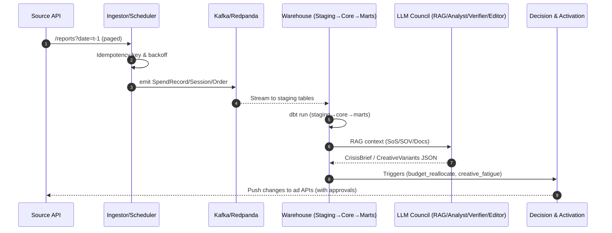
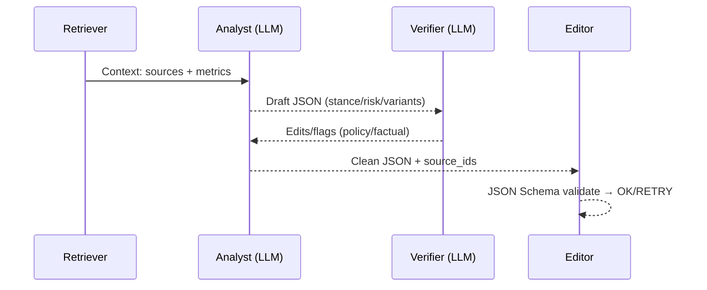
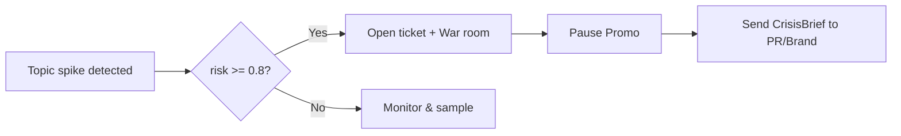
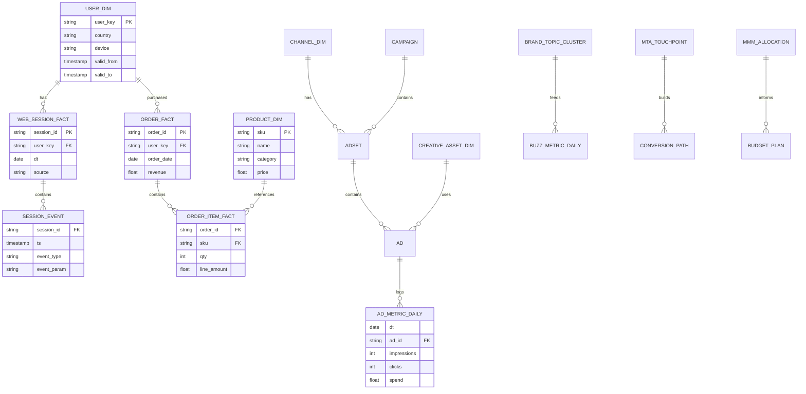

# MBI# Marketing Brand Intelligence (MBI) — Production Blueprint (v1.0)

**Purpose:** Bản thiết kế hợp nhất (blueprint) cho hệ thống **Marketing Brand Intelligence**: đo lường → hiểu → quyết định cho thương hiệu & hiệu quả marketing, tích hợp **LLM (council‑light)** an toàn, RAG‑only, có guardrails, playbooks và KPI vận hành.

---

## 0) Executive Summary

* **4 lớp:** Ingest → Unified SSOT & Identity → Intelligence (MMM/MTA/Brand/Creative/Audience) → Decision & Activation.
* **LLM dùng ở 8 điểm:** chuẩn hoá & trích xuất, stance/sentiment, crisis/fake‑PR verifier, topic/briefing, creative intelligence, MMM/MTA explainer, policy compliance, nội bộ Q&A.
* **Nguyên tắc LLM:** RAG‑only, có **source_ids**, Verifier tách biệt, temperature ≤ 0.2, JSON schema validation, audit đầy đủ.
* **MVP 1–2 tuần:** Ingest (Meta/Google Ads + GA4 + Shopify), MMM‑lite + MTA Markov, creative tagging cơ bản, 2 playbooks (budget reallocate, creative fatigue).

---

## 1) Kiến trúc tổng quan

```
[Data Ingest]
Ad platforms (Meta/Google/TikTok/YouTube) • GA4 • Shopify/Apps
CRM/CDP (HubSpot/Segment) • Social listening • Search trends
Surveys/brand-lift • Competitor & Share-of-Search • Reviews

   ↓
[Unified SSOT & Identity]
Event contracts (impression/click/session/order/spend)
Identity graph (user_id/email_hash/device/ga_client_id)
Feature Store (online/offline parity) • Quality & lineage

   ↓
[Intelligence Layer]
MMM (Bayesian) • MTA (privacy-safe) • Incrementality tests
Brand tracking (lift, share-of-search, buzz) • Creative Intelligence
Audience/topic clustering • Competitor & SOV dashboards

   ↓
[Decision & Activation]
Budget/reallocation • Pacing/bid guidance • Creative rotation
Audience expansion/negative lists • Alerts & playbooks • Approvals
Push về ad APIs (nhà quảng cáo) + guardrails & audit
```

---

## 2) Các module cốt lõi (best practice)

### 2.1 Data & Identity

* Kéo **spend/impressions/clicks** từ ad APIs; **session/order** từ GA4/Shopify; **CRM** từ CDP.
* **Identity resolution** (deterministic + probabilistic, privacy‑safe, hash PII).
* Chuẩn hoá timezone **UTC**, **idempotency** theo event key; SLA làm mới (hourly/daily); kiểm tra chất lượng (freshness, completeness, uniqueness).

### 2.2 Measurement

* **MMM (Bayesian)**: adstock + saturation (Hill), seasonality, promo, price; phân rã **base vs incremental** theo kênh/geo; cập nhật hàng tuần.
* **MTA (Multi‑Touch Attribution)**: Markov removal/Shapley trên touchpoint 1st‑party (cookie‑less friendly); dùng bands, không theo dõi cá nhân nhạy cảm.
* **Incrementality**: geo‑experiment/PSA/lift‑study để “neo” MMM/MTA và hiệu chỉnh ROAS increment.
* **Brand tracking**: *Share of Search (SoS)*, *Brand lift*, *Buzz & stance* (social), *Share of Voice (SOV)*.

### 2.3 Creative Intelligence

* Tự gắn nhãn creative (vision+text embeddings: chủ đề/USP/màu/tone/CTA).
* Phát hiện **creative fatigue** (CTR/CVR ↓ theo thời gian, frequency ↑) và đề xuất **rotate/promote**.
* Sinh **biến thể** copy/visual từ **winning motifs** (RAG từ SSOT), kèm kiểm chính sách.
* Ma trận *Asset × Audience × Context* → "what works where".

### 2.4 Audience & Topic Intelligence

* Cluster chủ đề/intent (search + social + onsite behavior).
* Xây **whitelist/negative list** động; phát hiện overlap đối tượng giữa kênh; competitor SOV.

### 2.5 Decision Engine & Activation

* **Budget Optimizer**: tối ưu phân bổ dưới ràng buộc ngân sách & ROAS/CAC/LTV.
* **Pacing/Bid**: canh chi tiêu ngày/tuần, giữ CPA mục tiêu; đặt guardrails chuyển kênh ≤ 25%/tuần.
* **Creative rotation**: pause khi fatigue, đẩy motif thắng cuộc.
* **Playbooks** tự động + phê duyệt (human‑in‑the‑loop cho case nhạy cảm).

### 2.6 Governance & Observability

* **Policy pack** (quyền riêng tư, nhãn quảng cáo, giới hạn claim, fairness).
* **RBAC/KMS**, secret rotation; **OTEL traces**; dashboard SLO/KPI; đầy đủ **audit** decision + activation.

---

## 3) LLM Orchestration (council‑light)

### 3.1 Vị trí dùng LLM (8 điểm)

1. Chuẩn hoá & trích xuất
2. Stance & Sentiment (kèm giải thích ngắn)
3. Crisis/FUD/Fake‑PR **Verifier**
4. Topic & Briefing (tóm tắt điều hành)
5. Creative Intelligence (tag motif, sinh biến thể có RAG)
6. MMM/MTA Explainer (natural language)
7. Policy & Compliance check (Promo/広告, claims)
8. Q&A nội bộ (RAG‑only từ SSOT & dashboards)

> **Nguyên tắc:** LLM là lớp suy luận & kiểm chứng cuối. Mọi đầu ra phải kèm **source_ids**.

### 3.2 Pipeline LLM

```
[Retriever (RAG)] → [Analyst] → [Verifier] → [Editor]
```

* **Router (định tuyến model):**

  * Tác vụ ngắn/nhãn: **local_small** (7–14B)
  * Tóm tắt/đa ngôn ngữ/khó: **managed_main**
  * Policy/factual verifier: **managed_verifier** (mô hình khác, nghiêm khắc hơn)
* **FinOps:** cache RAG, batch calls, max_tokens/temperature, timeout & retry, **idempotency key**.

### 3.3 Guardrails

* **RAG‑only**, trích **source_ids**; nếu nguồn < 2 → *unclear* + action "verify_official".
* **Compliance:** nhãn **Promo/広告**, cấm claim y tế/tài chính, frequency capping, crisis‑gate.
* **Privacy:** chỉ dùng dữ liệu hợp pháp, hash PII; tránh suy luận cá nhân nhạy cảm.
* **Safety filters:** toxicity/PII detector trước phát hành.
* **Determinism:** temperature ≤ 0.2, prompt cố định, seed nếu hỗ trợ; validate **JSON Schema**, log **prompt_hash**/**output_hash**.

---

## 4) Data Contracts (rút gọn)

### 4.1 SpendRecord

```json
{"date":"2025-10-12","channel":"meta","campaign_id":"c1","adset_id":"a1",
 "spend":120000,"currency":"JPY","impressions":45000,"clicks":1200}
```

### 4.2 WebSession

```json
{"session_id":"s123","user_key":"uhash...","source":"google_cpc",
 "landing":"lp1","events":[{"t":"view","p":"/"},{"t":"add_to_cart","sku":"SKU-1"}]}
```

### 4.3 Order

```json
{"order_id":"o123","user_key":"uhash...","revenue":19800,"items":[{"sku":"SKU-1","qty":1}]}
```

### 4.4 CreativeAsset

```json
{"asset_id":"vid_77","modality":"video","tags":["UGC","unboxing","green"],
 "metrics":{"ctr":0.019,"cvr":0.032,"avg_freq":3.1}}
```

### 4.5 MMMEstimate (per channel)

```json
{"channel":"meta","alpha":0.42,"beta":0.68,"half_life_days":12,"sat_point":250000,
 "roi_curve":[{"spend":100000,"rev_inc":220000},{"spend":200000,"rev_inc":360000}]}
```

### 4.6 CrisisBrief (LLM output)

```json
{
  "topic_id": "cl_20251012_001",
  "stance": "against|for|neutral|unclear",
  "risk_score": 0.82,
  "reasons": ["No press release on official domain", "Velocity spike in low-trust forums"],
  "actions": ["verify_official","prepare_holding","pause_promo"],
  "sources": [
    {"id":"src_1","url":"https://...","quote":"..."},
    {"id":"src_2","url":"https://...","quote":"..."}
  ]
}
```

### 4.7 CreativeVariants (LLM output)

```json
{
  "asset_brief_id":"cb_778",
  "variants":[
    {"text":"(Promo/広告) ...", "cta":{"label":"See details","url":"https://..."}, "policy_ok": true, "source_ids":["ssot_doc_3"]}
  ],
  "notes":"Fatigue risk low; aligns with 'UGC-unboxing' motif"
}
```

---

## 5) Công thức & tối ưu hoá

* **Adstock:** `x'_t = x_t + λ x'_{t-1}`
* **Saturation (Hill):** `f(x') = α * (x'^β / (θ^β + x'^β))`
* **Revenue_t:** `Base_t + Σ_channel f(adstock(spend_channel,t)) + controls (seasonality, price, promo)`
* **Budget allocation:** tối ưu Σ `f_c(spend_c)` với Σ `spend_c = B` và ràng buộc ROAS/CAC theo kênh.
* **Creative fatigue:** khi `∂CTR/∂freq < -τ` trong `k` ngày ⇒ rotate/out.

---

## 6) Prompts (dán là chạy — RAG‑only, JSON‑strict)

### 6.1 Crisis Brief / Verifier

```
SYSTEM: You are a Brand Intelligence analyst. Use ONLY the provided sources.
Never invent facts. If evidence is insufficient, say "unclear".
Label promotional content explicitly as Promo/広告 when applicable.

INPUT:
- task: "crisis_brief"
- language: ja|vi|en
- brand: "<brand>"
- context_metrics: {velocity:..., sos:..., sov:...}
- sources: [{id, url, title, text}], official_domains: ["<brand>.co.jp","<brand>.com"]

TASKS:
1) Decide stance (against/for/neutral/unclear).
2) Compute risk_score in [0,1] (qualitative → numeric).
3) List 2–4 concise reasons with direct short quotes.
4) Output JSON strictly matching CrisisBrief schema.
5) If no corroboration from ≥2 independent sources → suggest "verify_official" action.

OUTPUT: JSON only.
```

### 6.2 Creative Intelligence — Variants with Policy Check

```
SYSTEM: You are a compliant creative assistant. Use facts from SSOT only.
Always label promotional messages as Promo/広告.

INPUT:
- language: ja|vi|en
- product_ssot: {features[], price, policies, claims_allowed[], claims_banned[]}
- winning_motifs: ["UGC","comparison","problem-solution"]
- constraints: {max_chars: 220, include_cta: true}
- target_persona: "SMB|consumer|enterprise"

TASKS:
1) Generate 3 short variants with CTA.
2) Avoid banned claims; if unsure, ask a yes/no clarifying line.
3) Attach source_ids used.

OUTPUT: CreativeVariants JSON.
```

---

## 7) API & Orchestration (rút gọn)

### 7.1 FastAPI Webhook (ví dụ — idempotency)

```python
@app.post("/ads/ingest/spend-daily")
def spend_daily(payload: SpendRecord):
    idem = f"spend:{payload.channel}:{payload.date}:{payload.campaign_id}"
    if already_processed(idem):
        return {"ok": True}
    write_spend(payload)
    return {"ok": True}
```

### 7.2 LLM Multi‑Provider Call (pseudo‑code)

```python
content, idem = call_llm(
  model="managed_main",
  system=system_prompt,
  user=user_prompt_json,
  max_tokens=800,
  temperature=0.2,
  timeout=30
)
# Validate JSON schema → if invalid: RETRY WITH SCHEMA
```

### 7.3 Playbook hooks (Prefect/n8n)

* **on_topic_spike:** Retriever → Analyst(crisis_brief) → Verifier(policy+factual) → nếu `risk ≥ 0.8` ⇒ ticket + war‑room, **pause_promo**, gửi brief cho PR/Brand Lead.
* **on_creative_fatigue:** Analyst(creative) → Verifier(policy) → gửi 3 variants cho ad‑ops (campaign_id gắn kèm).

---

## 8) Playbooks (YAML)

### 8.1 budget_reallocate.yml

```yaml
when:
  - mmm.roas_weighted < target_roas OR mta.cac > target_cac
steps:
  - compute_optimal_mix: {budget: "{{B_week}}", channels: ["meta","search","tiktok","yt"]}
  - guardrails:
      - keepout_channels: ["brand_protection_campaigns"]
      - max_shift_pct_per_week: 25
  - approvals: ["Performance Lead","Brand Lead"]
  - activate_changes: true
```

### 8.2 creative_fatigue.yml

```yaml
when:
  - creative.fatigue_score > 0.7
steps:
  - pause_assets: {top_k_by_spend: 3}
  - promote_assets: {top_k_by_ctr: 3}
  - request_new_variants: {brief_from: "winning_motifs"}
```

---

## 9) KPI vận hành

* **Brand:** Share of Search, Brand Lift (%), SOV, Buzz sentiment/stance.
* **Hiệu quả:** **ROAS increment**, **CAC**, **LTV/CAC**, **Payback**.
* **Creative:** ΔCTR/ΔCVR vs baseline, fatigue days, win‑rate motif.
* **Ops:** Data freshness, model drift, % spend theo khuyến nghị được áp dụng.

---

## 10) Bảo mật & Tuân thủ

* Thu thập & xử lý dữ liệu hợp pháp; **hash/pseduo‑anonymize PII**; TTL/xoá theo chính sách.
* **RBAC/KMS**, secret rotation; **audit** mọi action tự động; chống lạm dụng (frequency capping, opt‑out).
* **Crisis‑gate:** nếu BI flag P1/P2 → tắt quảng bá, chỉ cho phép thông điệp trấn an/FAQ đã duyệt.

---

## 11) Lộ trình triển khai

### MVP (1–2 tuần)

* Ingest: Meta/Google Ads + GA4 + Shopify; chuẩn hoá **Spend/Session/Order**.
* MMM‑lite (Bayesian) theo tuần + MTA Markov đơn giản.
* Creative tagging cơ bản + dashboard KPI.
* Playbooks: **budget_reallocate** + **creative_fatigue** (phê duyệt thủ công).

### Phase 2–3

* Thêm TikTok/YouTube/Twitter Ads, survey brand‑lift, share‑of‑search.
* Geo‑experiment để "neo" MMM; optimizer theo ràng buộc ROAS/CAC/LTV.
* Audience/topic clustering & competitor SOV; tự động activation có guardrails.

---

## 12) Vận hành hàng ngày

* **Sáng thứ Hai:** xem **mix đề xuất tuần** (MMM) + cảnh báo creative fatigue.
* **Giữa tuần:** kiểm tra pacing/bid, CAC lệch; chạy playbook reallocate ≤ 25%.
* **Thứ Sáu:** review brand KPIs (SoS/brand lift), xác nhận thay đổi ngân sách tuần sau.
* **Hàng tháng:** cập nhật model, kiểm thử incrementality, điều chỉnh policy/weights.

---

## 13) Checklist triển khai nhanh

* [ ] Kết nối ad APIs, GA4, Shopify, CRM/CDP; chuẩn hoá sự kiện theo **JSON Schemas** trên.
* [ ] Dựng **Feature Store** (online/offline parity) + **Identity Graph** (privacy‑safe).
* [ ] Train MMM‑lite; cấu hình MTA Markov; định nghĩa mục tiêu ROAS/CAC & ràng buộc.
* [ ] Bật LLM **council‑light** (Retriever/Analyst/Verifier/Editor) + guardrails RAG‑only.
* [ ] Khai báo **policy pack** (Promo/広告, claims, crisis‑gate) + RBAC/KMS.
* [ ] Dashboard KPI + OTEL + audit trail; 2 playbooks hoạt động end‑to‑end.

---

> **Ghi chú:** Tất cả prompt LLM phải trích dẫn **source_ids**; mọi quyết định tự động đều qua log & approvals (khi cần). Khi cần, mở rộng thành Council‑full (thêm Critic/Planner) nhưng giữ determinism & chi phí thấp bằng cache/batch.

---

## 14) Mermaid Diagrams — Architecture & Dataflow

### 14.1 System Architecture (layers)

```mermaid
flowchart TB
  subgraph Sources[Data Sources]
    A1[Ad Platforms
Meta/Google/TikTok/YouTube]
    A2[GA4 / Web / Apps]
    A3[Shopify / App Stores]
    A4[CRM/CDP
HubSpot/Segment]
    A5[Social Listening]
    A6[Search Trends]
    A7[Surveys / Brand Lift]
    A8[Competitor & Reviews]
  end

  subgraph Ingest[Ingestion & Transport]
    I1[Connectors & API Clients]
    I2[Webhook Receiver
(HMAC verify)]
    I3[Scheduler & Backfill
(Prefect)]
    I4[Event Bus
Kafka/Redpanda]
    I5[DLQ & Retry]
  end

  subgraph SSOT[Unified SSOT & Identity]
    S1[Event Contracts
(JSON Schema/Pydantic)]
    S2[Identity Graph
(hash PII)]
    S3[Feature Store
(online/offline parity)]
    S4[Staging Zone]
    S5[Core & Marts
(BigQuery/Postgres)]
  end

  subgraph Intel[Intelligence Layer]
    M1[MMM (Bayesian)]
    M2[MTA (Markov/Shapley)]
    M3[Incrementality Tests]
    B1[Brand Tracking
(SoS/SOV/Buzz/Stance)]
    C1[Creative Intelligence]
    U1[Audience/Topic Clustering]
  end

  subgraph Decision[Decision & Activation]
    D1[Budget Optimizer]
    D2[Pacing/Bid Guidance]
    D3[Creative Rotation]
    D4[Alerts & Playbooks
(Approvals)]
    D5[Push to Ad APIs]
  end

  subgraph LLM[LLM Council-light]
    L1[Retriever (RAG)]
    L2[Analyst]
    L3[Verifier]
    L4[Editor]
  end

  subgraph Obs[Governance & Observability]
    G1[Policy Pack
(Privacy/Promo/Fairness)]
    G2[RBAC/KMS]
    G3[OTEL Traces]
    G4[Audit & Metrics]
  end

  Sources --> Ingest --> SSOT --> Intel --> Decision --> D5
  SSOT -->|context| LLM -->|JSON outputs| SSOT
  Decision -->|events| Obs
```

### 14.2 End-to-End Dataflow (events)



### 14.3 LLM Council-light (reason-then-act)



### 14.4 Decision Playbook (example)



---

## 15) Warehouse ERD (BigQuery/Postgres)



---

## 16) dbt Project Skeleton (BQ/Postgres)

**Folders**

```
models/
  staging/
    stg_meta_ads__spend_daily.sql
    stg_google_ads__spend_daily.sql
    stg_ga4__sessions.sql
    stg_shopify__orders.sql
    stg_social__buzz.sql
  core/
    fct_ad_metric_daily.sql        # incremental by dt+ad_id
    fct_web_session.sql            # incremental by session_id
    fct_order.sql                  # incremental by order_id
    dim_user.sql                   # SCD2 from snapshot
    dim_product.sql
    dim_channel.sql
    dim_creative_asset.sql
  marts/
    mkt_perf__roas_increment.sql
    mkt_brand__sov_sos.sql
    mkt_creative__fatigue_score.sql
    mkt_mix__allocation_curve.sql
snapshots/
  snap_user_dim.sql
seeds/
  channel_map.csv
sources.yml
```

**sources.yml (rút gọn)**

```yaml
version: 2
sources:
  - name: raw
    schema: raw
    freshness:
      warn_after: {count: 6, period: hour}
      error_after: {count: 12, period: hour}
    tables:
      - name: meta_ads_spend_daily
        loaded_at_field: _loaded_at
      - name: ga4_sessions
        loaded_at_field: _loaded_at
      - name: shopify_orders
        loaded_at_field: _loaded_at
```

**Incremental model ví dụ (BigQuery syntax)**

```sql
{{ config(materialized='incremental', unique_key='ad_id_dt') }}

with src as (
  select dt, ad_id, impressions, clicks, spend
  from {{ source('raw','meta_ads_spend_daily') }}
  where dt >= date_sub(current_date(), interval 3 day) -- watermarked backfill
)
select
  concat(cast(dt as string),'_', ad_id) as ad_id_dt,
  *
from src

  where dt > (select coalesce(max(dt), date('1970-01-01')) from {{ this }})

```

**Snapshot SCD2 (user)**

```yaml
version: 2
snapshots:
  - name: snap_user_dim
    target_database: {{ target.database }}
    target_schema: snapshot
    strategy: timestamp
    updated_at: updated_at
    unique_key: user_key
    source_table: {{ ref('stg_cdp__users') }}
```

**Tests (example)**

```yaml
version: 2
models:
  - name: fct_ad_metric_daily
    tests:
      - unique:
          column_name: ad_id_dt
      - not_null:
          column_name: spend
```

---

## 17) AI Model Catalog & Routing

**Purpose:** nêu rõ **gọi mô hình nào** cho từng tác vụ + loại mô hình tương ứng. Tên dưới đây là **ví dụ đại diện**; thay bằng lựa chọn thực tế trong môi trường của bạn.

| Task                       | Loại mô hình      | Local/OSS (ví dụ)              | Managed (ví dụ)             | Fallback   | Ghi chú                     |
| -------------------------- | ----------------- | ------------------------------ | --------------------------- | ---------- | --------------------------- |
| Embedding (search/cluster) | Text embedding    | e5‑base / bge‑m3               | Managed embedding high‑dim  | BM25       | Chuẩn hoá ngôn ngữ ja/vi/en |
| Rerank                     | Cross‑encoder     | ms‑marco MiniLM / XLM‑R CE     | Managed reranker            | N/A        | top‑k ≤ 100                 |
| Stance (NLI)               | Cross‑lingual NLI | XLM‑R large NLI / DeBERTa‑MNLI | General LLM (zero‑shot NLI) | Rules      | Yêu cầu quote minh hoạ      |
| Sentiment                  | Regression        | RoBERTa‑base finetune domain   | Managed sentiment           | Lexicon    | Trả về −1..+1               |
| Toxicity/Policy            | Classifier        | detoxify / classifier nhỏ      | Managed safety              | Rules      | Chặn PII/toxic              |
| Summarize/Brief            | General LLM       | 13–34B local nếu đủ            | High‑cap LLM                | Extractive | RAG‑only + max 10 dòng      |
| Creative Variants          | General LLM       | 34–70B local (nếu GPU)         | High‑cap LLM                | Template   | Nhãn Promo/広告 bắt buộc      |
| Verifier (factual/policy)  | General LLM khác  | 13–34B                         | High‑cap LLM khác           | Rules      | Model khác với Analyst      |
| OCR                        | Vision            | PaddleOCR/Tesseract            | VLM managed                 | N/A        | PDF/image ingest            |
| Translation                | NMT               | Marian/Opus‑MT                 | Cloud translate             | N/A        | Ja↔Vi↔En                    |

**ModelRegistry.yaml (mẫu)**

```yaml
registry:
  local_small:
    task: [tagging, sentiment]
    models: ["oss:e5-base", "oss:roberta-sentiment"]
  local_medium:
    task: [nli, rerank]
    models: ["oss:xlmr-nli", "oss:miniLM-cross-enc"]
  managed_main:
    task: [summary, creative, complex_multi]
    models: ["providerA:general-llm"]
  managed_verifier:
    task: [policy_check, factual_verify]
    models: ["providerB:general-llm"]
embeddings:
  default: "oss:bge-m3"
reranker:
  default: "oss:miniLM-cross-enc"
```

**RoutingPolicy.yaml (mẫu)**

```yaml
routes:
  stance: {use: local_medium, fallback: managed_main}
  sentiment: {use: local_small}
  crisis_brief: {use: managed_main, verify: managed_verifier}
  creative_variants: {use: managed_main, verify: managed_verifier}
  qa_internal: {use: local_medium, fallback: managed_main}
limits:
  max_tokens: 800
  temperature: 0.2
  timeout_s: 30
```

---

## 18) Ingestion — Chi tiết kết nối & SLA

### 18.1 Lịch chạy & cửa sổ backfill

* **Daily 04:00 UTC** cho báo cáo theo ngày; **Hourly** cho sự kiện realtime.
* **Backfill an toàn:** lấy `t−2 .. t` (48h) để bắt kịp chậm trễ API; dùng **watermark** theo (date, updated_at).

### 18.2 Idempotency & chất lượng

* Idempotency key: `<source>:<table>:<natural_key>` (ví dụ: `meta:c1:2025-10-11`).
* Kiểm tra: completeness (rowcount vs spend), uniqueness (keys), freshness (loaded_at), schema drift.
* **DLQ** cho lỗi không khắc phục ngay; cảnh báo Slack/Email.

### 18.3 Connectors (tóm tắt thực dụng)

* **Meta Marketing API**: pull `ad_insights` theo `level=ad`, `time_increment=1`; fields: impressions, clicks, spend, reach; paginate `after` cursor; respect rate‑limit.
* **Google Ads API**: GAQL query `customer, campaign, ad_group_ad`; date range `YESTERDAY`; batching 10k rows.
* **TikTok/YouTube Ads**: endpoints tương đương (spend/impr/click); tiêu chuẩn hoá `channel_dim`.
* **GA4**: ưu tiên **BigQuery Export**; fallback Reporting API v1; session→events chuẩn hoá.
* **Shopify**: Orders, Refunds; chỉ lấy trường marketing cần thiết (utm, discount, total_price); PII **hash**.
* **CRM/CDP (HubSpot/Segment)**: contacts/deals hoặc track events; map `user_key` từ email hash/ga_client_id.
* **Social Listening**: RSS/APIs của nền tảng hoặc vendor; lưu raw text + url + author + timestamp + lang.
* **Search Trends**: snapshot theo tuần; chuẩn hoá về index 0–100; lưu theo từ khoá/brand.
* **Surveys/Brand Lift**: import file/Sheet/API; lưu sample size, phương pháp, CI.

### 18.4 BigQuery vs Postgres (khuyến nghị)

* **BigQuery**: lưu staging ở `raw.*`, core ở `core.*`, marts ở `marts.*`; dùng partition `dt` + cluster theo id; dbt `incremental` + `merge`.
* **Postgres**: dùng `timescaledb` hoặc partition by range (dt); upsert `ON CONFLICT`; lưu ý VACUUM/ANALYZE định kỳ.

### 18.5 PII & Quyền riêng tư

* Hash/salt email/phone; tách bảng `PII_MAP` (restricted schema); TTL/xoá theo policy; chỉ join qua `user_key`.

---

## 19) Examples — Ingestion Job (Prefect pseudo)

```python
@flow(name="fetch-meta-daily")
def fetch_meta(date: date):
    pages = pull_meta_insights(date)
    for p in pages:
        key = f"meta:ad_insights:{p['ad_id']}:{p['date']}"
        if not idempotent(key):
            write_raw("meta_ads_spend_daily", p)
    trigger_dbt_run(models=["stg_meta_ads__spend_daily","fct_ad_metric_daily"])  # staging→core
```

---

> **Tip:** Bắt đầu với BigQuery Export của GA4 + 2 nguồn ads (Meta/Google). Thêm `mkt_creative__fatigue_score` để bật playbook creative_fatigue. Khi ổn định, đưa crisis_brief/creative_variants (LLM) vào quy trình approvals để kích hoạt tự động hoá an toàn.
